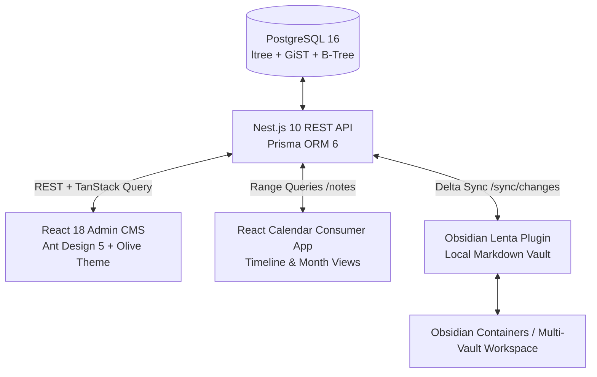

# 🍋 Project Lenta / Lemon Calendarium — Intermediate Architecture & State Specification

> **Target Audience**: External AI (Gemini / Claude / ChatGPT) & Project Collaborators  
> **Purpose**: Single-source comprehensive context document to discuss architecture, next feature phases (React Calendar App, Obsidian 2-way sync, monorepo consolidation, UI enhancements), and evaluate differences between the initial MVP specification and the current implementation.  
> **Last Updated**: August 2026  
> **Repository**: `lemon-calendarium` (`The-Lemon-Team/lemon-seasons`)

---

## 📑 Table of Contents

1. [Executive Summary & Core Mission](#1-executive-summary--core-mission)
2. [Architectural Constraints & Load-Bearing Walls](#2-architectural-constraints--load-bearing-walls)
3. [Component Ecosystem & Tech Stack](#3-component-ecosystem--tech-stack)
4. [Evolution & Differences: Initial MVP vs. Current State](#4-evolution--differences-initial-mvp-vs-current-state)
5. [Current Database Schema & Data Models (Prisma)](#5-current-database-schema--data-models-prisma)
6. [API & Sync Protocol Specification](#6-api--sync-protocol-specification)
7. [Obsidian Integration & Markdown/YAML Mapping](#7-obsidian-integration--markdownyaml-mapping)
8. [Frontend Admin CMS Architecture & Design System](#8-frontend-admin-cms-architecture--design-system)
9. [Repository Structure & State of Monorepo](#9-repository-structure--state-of-monorepo)
10. [Key Discussion Topics & Next Steps for External Gemini](#10-key-discussion-topics--next-steps-for-external-gemini)

---

## 1. Executive Summary & Core Mission

**Project Lenta** (also referred to as **Lemon Calendarium** / **Lemon Seasons**) is a high-performance **headless chronological data hub and CMS**. It acts as the single source of truth for time-anchored information: events, milestones, media releases, historical timelines, and notes.

The system serves three complementary client applications:
1. **Admin CMS**: React 18 + Ant Design 5 + TanStack Query desktop web dashboard for power-user content management, tagging, media uploads, and feed governance.
2. **React Calendar App**: Dedicated consumer application providing interactive chronological visualizations (Month, Week, Day, Timeline/Лента views) driven by range queries on `[startDate, endDate]`.
3. **Obsidian Local Sync Plugin & Vault System**: Offline-first bi-directional synchronization bridge that mirrors Lenta notes into local Obsidian Markdown files (`.md` with structured YAML frontmatter) and virtual folder trees.



---

## 2. Architectural Constraints & Load-Bearing Walls

The architecture is governed by key principles designed to preserve data integrity across distributed and offline-first consumers:

1. **Sync-Ready Everywhere**: Every core entity contains `updatedAt: DateTime` and `deletedAt: DateTime?` (soft deletes). Physical records are never abruptly deleted during sync pulls to guarantee local clients can reconcile deletions.
2. **Content Agnostic**: The `description` field in notes stores raw Markdown text. Rich formatting, embeds, and internal links remain portable across web, mobile, and Obsidian.
3. **Dual Hierarchical Organization**:
   - **Ltree Taxonomy Nodes**: PostgreSQL native `ltree` extension for dot-separated semantic paths (`world.europe.france`) supporting prefix matching, sub-tree queries, and hierarchical aggregations.
   - **Virtual Folders (`Folder` & `NoteFolder`)**: Explicit file-system-style directory hierarchies with `isPrimary` flags, enabling 1:1 parity with Obsidian vault folder trees.
4. **Optimized Indexing**:
   - Composite B-Tree index on `[startDate, endDate]` for fast time-window queries.
   - B-Tree index on `[updatedAt]` across all models for sub-millisecond delta sync queries (`/sync/changes?since=<ISO_TIMESTAMP>`).
   - GiST index on `TaxonomyNode.path` (`ltree`).

---

## 3. Component Ecosystem & Tech Stack

| Layer | Technologies | Key Responsibilities |
|---|---|---|
| **Backend API** | Nest.js 10, TypeScript, Prisma ORM 6, Swagger / OpenAPI | REST endpoints, delta sync engine, hashtag auto-extraction, validation pipes, storage handling |
| **Database** | PostgreSQL 16 (Dockerized on port `5433`) with `ltree` extension | Relational storage, GiST indexing for taxonomy paths, soft-delete tracking |
| **Frontend Admin** | React 18, Vite, Ant Design 5, TanStack Query v5, React Router v7, Tailwind CSS, Lucide React | Dark olive UI theme (`#c9cd58`), Note Editor with live Markdown preview, LinkManager, ImageManager, FolderExplorer, QuickAdd modal |
| **Obsidian Plugin** | TypeScript, esbuild, Obsidian API | `packages/obsidian-lenta-plugin`: Local vault sync, frontmatter serialization/deserialization, folder creation |
| **Obsidian Containers** | Docker Compose, Monorepo packages (`@workspace/server`, `@workspace/obsidian-plugin`, `@workspace/shared`, `@workspace/web`) | `packages/obsidian-containers`: Multi-vault sandbox testing and Git-backed sync services |

---

## 4. Evolution & Differences: Initial MVP vs. Current State

The following breakdown highlights how the system expanded from the initial baseline specification into the current implementation.

### 4.1 Summary Comparison Table

| Feature Dimension | Initial Version (MVP Spec) | Current State (Implemented / Staged) | Rationale & Impact |
|---|---|---|---|
| **Link Management** | Single scalar string: `sourceLink: String?` | Dedicated `NoteLink` entity with `url`, `title`, `isSource` boolean flag, and `order` | Notes often reference multiple sources (primary article, archive link, video, documentation). Legacy `sourceLink` is preserved as fallback. |
| **Image & Media Handling** | Single optional `icon: String?` string | Rich `NoteImage` entity (`url`, `thumbnailUrl`, `mimeType`, `sizeBytes`, `dimensions`, `caption`, `alt`, `isMain`, `order`) | Notes require hero cover images, gallery attachments, and metadata for both web calendar cards and Obsidian embed cards. |
| **Hashtags** | None (only hierarchical taxonomy tags) | First-class `Hashtag` entity with auto-extraction from Markdown body + explicit tagging | Users write `#hashtags` naturally in Markdown descriptions; backend automatically indexes and links them to notes for rapid filtering. |
| **Vault / Folder Structure** | Only `TaxonomyNode` (dot-path `ltree`) | Added `Folder` & `NoteFolder` junction model (`path`, `isPrimary`, `order`, `icon`, `color`) | Separates semantic classification (taxonomy topics) from storage location (Obsidian directory tree), allowing a primary folder with multi-folder inclusion. |
| **Taxonomy UI & Visuals** | Plain text path string | Visual icons (`icon` field), Lucide icon pickers, expandable tree explorer, note counters, tag search dropdown in note forms | Greatly improves navigation in large hierarchical taxonomy sets. |
| **Note Editor UX** | Simple single-column form with textarea | 2-column layout: Left column (title, live preview Markdown editor, images, dates), Right sidebar (Feeds, Taxonomy tags search, Hashtags, Folder selector, compact LinkManager) | Optimizes screen real estate and workflow speed for editing detailed notes. |
| **Quick Add Modal** | Minimal basic title + feed modal | Global modal accessible via navbar with NoteType selector, date range, feed selector, taxonomy path, hashtags, and Markdown input | Enables instant capture without navigating away from the current page. |
| **Delta Sync Scope** | Synchronized only Feeds, Notes, TaxonomyNodes | Synchronizes Feeds, Notes (with nested images & links), TaxonomyNodes, Hashtags, Folders, NoteFolders | Provides full state replication for offline-first clients (Obsidian, Calendar). |
| **Obsidian Ecosystem** | Conceptual design | Fully functional Obsidian plugin in `packages/obsidian-lenta-plugin` + containerized sandbox in `packages/obsidian-containers` | Actual running implementation with YAML frontmatter parser and sync engine. |

---

### 4.2 Detailed Entity Evolution

#### Note Model Evolution
```diff
 model Note {
   id          String    @id @default(uuid())
   feedId      String
   feed        Feed      @relation(fields: [feedId], references: [id])
   title       String
   description String?   // Raw Markdown
   type        NoteType
   startDate   DateTime
   endDate     DateTime?
   sourceLink  String?   // Retained for backward-compat
   icon        String?
   tags        TaxonomyNode[]
+  hashtags    Hashtag[]
+  images      NoteImage[]
+  links       NoteLink[]
+  folders     NoteFolder[]
   createdAt   DateTime  @default(now())
   updatedAt   DateTime  @updatedAt
   deletedAt   DateTime?
 
   @@index([startDate, endDate])
   @@index([updatedAt])
 }
```

#### New Entities Added

1. **`NoteLink`**
   ```prisma
   model NoteLink {
     id        String    @id @default(uuid())
     noteId    String
     note      Note      @relation(fields: [noteId], references: [id], onDelete: Cascade)
     url       String
     title     String?
     isSource  Boolean   @default(false)
     order     Int       @default(0)
     createdAt DateTime  @default(now())
     updatedAt DateTime  @updatedAt

     @@index([noteId])
     @@index([noteId, isSource])
     @@index([noteId, order])
   }
   ```

2. **`NoteImage`**
   ```prisma
   model NoteImage {
     id           String    @id @default(uuid())
     noteId       String
     note         Note      @relation(fields: [noteId], references: [id], onDelete: Cascade)
     url          String
     thumbnailUrl String?
     filename     String
     mimeType     String
     sizeBytes    Int
     width        Int?
     height       Int?
     caption      String?
     alt          String?
     isMain       Boolean   @default(false)
     order        Int       @default(0)
     createdAt    DateTime  @default(now())
     updatedAt    DateTime  @updatedAt

     @@index([noteId])
     @@index([noteId, isMain])
     @@index([noteId, order])
   }
   ```

3. **`Hashtag`**
   ```prisma
   model Hashtag {
     id        String    @id @default(uuid())
     name      String    @unique
     notes     Note[]
     createdAt DateTime  @default(now())
     updatedAt DateTime  @updatedAt
     deletedAt DateTime?

     @@index([name])
     @@index([updatedAt])
   }
   ```

4. **`Folder` and `NoteFolder`**
   ```prisma
   model Folder {
     id          String       @id @default(uuid())
     name        String
     path        String       @unique
     icon        String?
     color       String?
     noteFolders NoteFolder[]
     createdAt   DateTime     @default(now())
     updatedAt   DateTime     @updatedAt
     deletedAt   DateTime?

     @@index([path])
     @@index([updatedAt])
   }

   model NoteFolder {
     id        String   @id @default(uuid())
     noteId    String
     note      Note     @relation(fields: [noteId], references: [id], onDelete: Cascade)
     folderId  String
     folder    Folder   @relation(fields: [folderId], references: [id], onDelete: Cascade)
     isPrimary Boolean  @default(false)
     order     Int      @default(0)
     createdAt DateTime @default(now())
     updatedAt DateTime @updatedAt

     @@unique([noteId, folderId])
     @@index([noteId])
     @@index([folderId])
     @@index([noteId, isPrimary])
   }
   ```

---

## 5. Current Database Schema & Data Models (Prisma)

### Complete `schema.prisma`

```prisma
datasource db {
  provider = "postgresql"
  url      = env("DATABASE_URL")
}

generator client {
  provider = "prisma-client-js"
}

model Feed {
  id          String    @id @default(uuid())
  title       String
  description String?
  slug        String    @unique
  notes       Note[]
  createdAt   DateTime  @default(now())
  updatedAt   DateTime  @updatedAt
  deletedAt   DateTime?
}

model Note {
  id          String         @id @default(uuid())
  feedId      String
  feed        Feed           @relation(fields: [feedId], references: [id])
  title       String
  description String?        // Markdown
  type        NoteType
  startDate   DateTime
  endDate     DateTime?
  sourceLink  String?
  icon        String?
  tags        TaxonomyNode[]
  hashtags    Hashtag[]
  images      NoteImage[]
  links       NoteLink[]
  folders     NoteFolder[]
  createdAt   DateTime       @default(now())
  updatedAt   DateTime       @updatedAt
  deletedAt   DateTime?

  @@index([startDate, endDate])
  @@index([updatedAt])
}

model Folder {
  id          String       @id @default(uuid())
  name        String
  path        String       @unique
  icon        String?
  color       String?
  noteFolders NoteFolder[]
  createdAt   DateTime     @default(now())
  updatedAt   DateTime     @updatedAt
  deletedAt   DateTime?

  @@index([path])
  @@index([updatedAt])
}

model NoteFolder {
  id        String   @id @default(uuid())
  noteId    String
  note      Note     @relation(fields: [noteId], references: [id], onDelete: Cascade)
  folderId  String
  folder    Folder   @relation(fields: [folderId], references: [id], onDelete: Cascade)
  isPrimary Boolean  @default(false)
  order     Int      @default(0)
  createdAt DateTime @default(now())
  updatedAt DateTime @updatedAt

  @@unique([noteId, folderId])
  @@index([noteId])
  @@index([folderId])
  @@index([noteId, isPrimary])
}

model Hashtag {
  id        String    @id @default(uuid())
  name      String    @unique
  notes     Note[]
  createdAt DateTime  @default(now())
  updatedAt DateTime  @updatedAt
  deletedAt DateTime?

  @@index([name])
  @@index([updatedAt])
}

model NoteImage {
  id           String    @id @default(uuid())
  noteId       String
  note         Note      @relation(fields: [noteId], references: [id], onDelete: Cascade)
  url          String
  thumbnailUrl String?
  filename     String
  mimeType     String
  sizeBytes    Int
  width        Int?
  height       Int?
  caption      String?
  alt          String?
  isMain       Boolean   @default(false)
  order        Int       @default(0)
  createdAt    DateTime  @default(now())
  updatedAt    DateTime  @updatedAt

  @@index([noteId])
  @@index([noteId, isMain])
  @@index([noteId, order])
}

model NoteLink {
  id        String    @id @default(uuid())
  noteId    String
  note      Note      @relation(fields: [noteId], references: [id], onDelete: Cascade)
  url       String
  title     String?
  isSource  Boolean   @default(false)
  order     Int       @default(0)
  createdAt DateTime  @default(now())
  updatedAt DateTime  @updatedAt

  @@index([noteId])
  @@index([noteId, isSource])
  @@index([noteId, order])
}

model TaxonomyNode {
  id        String    @id @default(uuid())
  name      String
  path      String    @unique // Altered to ltree in migration
  icon      String?
  notes     Note[]
  updatedAt DateTime  @updatedAt
  deletedAt DateTime?
}

enum NoteType {
  SINGLE       // Point-in-time note/event
  PERIOD       // Span with startDate and endDate
  EVENT        // Calendar scheduled event
  FILM_RELEASE // Release entry with poster/dates
  MENTION      // Citation or external mention
  DONE         // Completed task or milestone
}
```

---

## 6. API & Sync Protocol Specification

### 6.1 Endpoints Overview

| Method | Endpoint | Description | Key Query / Body Params |
|---|---|---|---|
| `GET` | `/feeds` | List all active feeds with note count metrics | `includeDeleted=false` |
| `POST` | `/feeds` | Create feed with slug | `{ title, description?, slug? }` |
| `GET` | `/notes` | Query notes with multi-filtering | `feedId`, `type`, `startDateFrom`, `startDateTo`, `tagPath`, `hashtag`, `folderId`, `search`, `page`, `limit` |
| `POST` | `/notes` | Create note (with auto hashtag extraction) | `{ title, description?, type, startDate, endDate?, feedId, tagIds?, hashtags?, links?, images?, folderIds?, primaryFolderId? }` |
| `GET` | `/notes/:id` | Get note by ID with full relations | Includes `feed`, `tags`, `hashtags`, `images`, `links`, `folders` |
| `PUT` | `/notes/:id` | Update note | Full or partial payload; re-indexes hashtags & relations |
| `DELETE` | `/notes/:id` | Soft-delete note | Sets `deletedAt = NOW()` |
| `GET` | `/taxonomy/tree` | Get hierarchical tree of taxonomy nodes | Returns nested tree structure |
| `POST` | `/taxonomy` | Create taxonomy tag (root or child) | `{ name, path, icon? }` |
| `GET` | `/folders` | List virtual folders | Returns flat or tree folder structure |
| `POST` | `/folders` | Create folder | `{ name, path, icon?, color? }` |
| `GET` | `/hashtags` | List all hashtags with frequency counts | Search and sorting support |
| `GET` | `/sync/changes` | **Delta Sync Pull Endpoint** | `since=<ISO_TIMESTAMP>` |

### 6.2 Delta Sync Response Schema

```json
{
  "syncedAt": "2026-08-21T14:30:00.000Z",
  "since": "2026-08-21T00:00:00.000Z",
  "counts": {
    "feeds": 2,
    "notes": 15,
    "taxonomy": 4,
    "hashtags": 8,
    "folders": 3
  },
  "feeds": [
    { "id": "...", "title": "Cinema Releases", "slug": "cinema", "updatedAt": "...", "deletedAt": null }
  ],
  "notes": [
    {
      "id": "note-uuid",
      "feedId": "feed-uuid",
      "title": "Dune: Part Two Premiere",
      "description": "Premiere in London with stellar cast. #cinema #scifi",
      "type": "FILM_RELEASE",
      "startDate": "2026-03-01T18:00:00.000Z",
      "endDate": null,
      "icon": "film",
      "tags": [{ "id": "tax-1", "path": "entertainment.movies" }],
      "hashtags": [{ "id": "tag-1", "name": "cinema" }, { "id": "tag-2", "name": "scifi" }],
      "images": [{ "id": "img-1", "url": "/uploads/dune.jpg", "isMain": true, "order": 0 }],
      "links": [{ "id": "lnk-1", "url": "https://imdb.com/...", "title": "IMDb", "isSource": true }],
      "folders": [{ "folderId": "fld-1", "isPrimary": true, "folder": { "path": "Projects/Movies" } }],
      "updatedAt": "2026-08-21T10:00:00.000Z",
      "deletedAt": null
    }
  ],
  "taxonomy": [...],
  "hashtags": [...],
  "folders": [...]
}
```

---

## 7. Obsidian Integration & Markdown/YAML Mapping

The Obsidian integration (`packages/obsidian-lenta-plugin`) guarantees bi-directional parity between database records and filesystem Markdown files.

### 7.1 Frontmatter Serialization Format

```markdown
---
lenta_id: "e4d7a8f1-28c4-4b53-90d1-0f72782e4e1a"
feed: "cinema"
type: "FILM_RELEASE"
start_date: "2026-03-01T18:00:00.000Z"
end_date: null
primary_folder: "Projects/Movies"
folders:
  - "Projects/Movies"
  - "Archives/2026"
taxonomy:
  - "entertainment.movies"
tags:
  - "cinema"
  - "scifi"
links:
  - title: "IMDb"
    url: "https://imdb.com/title/tt15239678/"
    is_source: true
cover_image: "/uploads/dune.jpg"
updated_at: "2026-08-21T10:00:00.000Z"
deleted: false
---

# Dune: Part Two Premiere

Premiere in London with stellar cast. #cinema #scifi

Additional notes and content written inside Obsidian...
```

### 7.2 Synchronization Rules

1. **Folder Placement**: If a note has a `primaryFolder` path (e.g. `Projects/Movies`), the `.md` file is stored in `Vault/Projects/Movies/<note-slug-or-title>.md`.
2. **Hashtag Reconciliation**: Tags in frontmatter `tags:` and inline `#hashtags` are extracted and synced to the `Hashtag` table.
3. **Conflict Handling**: Last-write-wins based on `updated_at` timestamp comparison with a local change ledger.
4. **Soft Deletions**: Deleting a note in Lenta sets `deleted: true` or moves the note to a trash/archive folder in Obsidian rather than performing destructive file loss.

---

## 8. Frontend Admin CMS Architecture & Design System

### 8.1 Visual & UI Theme (*Lenta Admin System*)
- **Primary Accent**: Olive Gold `#c9cd58`
- **Surface Dark**: `#121414` (background), `#1b1e1e` (cards), `#242828` (borders/inputs)
- **Typography**: Inter (UI / Labels / Controls), JetBrains Mono (Dates, Slugs, UUIDs, Ltree paths)
- **Component Kit**: Ant Design 5 with Dark Algorithm token overrides and Tailwind CSS utilities.

### 8.2 Key UI Components
- **`NoteEditorPage`**: Two-column layout with split Markdown preview, dynamic `LinkManager`, `ImageManager`, `FolderSelect`, and `HashtagInput`.
- **`NotesListPage`**: Advanced multi-filter table (Filter by Feed, NoteType, Taxonomy, Hashtag, Folder, Date range, text search).
- **`FolderExplorer`**: Tree view for exploring and organizing notes by virtual folder paths.
- **`QuickAddModal`**: Floating quick-capture dialog with global keyboard shortcut (`Ctrl+N` / `Cmd+K`).
- **`TaxonomyPage`**: Visual hierarchy manager for nested `ltree` nodes with inline note count badges.

---

## 9. Repository Structure & State of Monorepo

```
lemon-calendarium/
├── backend/                      # Nest.js 10 Backend
│   ├── prisma/
│   │   ├── migrations/           # PostgreSQL migrations (including ltree & folder tables)
│   │   ├── schema.prisma         # Active Prisma schema
│   │   └── seed.ts               # Realistic demo seed data
│   ├── src/
│   │   ├── feeds/                # Feed management
│   │   ├── folders/              # Virtual folder management
│   │   ├── hashtags/             # Hashtags & auto-extraction
│   │   ├── notes/                # Notes CRUD & filtering
│   │   ├── storage/              # Image & media uploads
│   │   ├── sync/                 # Delta sync endpoint (/sync/changes)
│   │   └── taxonomy/             # Hierarchical taxonomy with ltree
│   └── package.json
│
├── frontend/                     # React 18 Admin CMS
│   ├── src/
│   │   ├── api/                  # TanStack Query hooks & client
│   │   ├── components/           # UI components (LinkManager, ImageManager, FolderExplorer, etc.)
│   │   ├── pages/                # Dashboard, Notes, NoteEditor, Feeds, Taxonomy
│   │   ├── theme/                # Ant Design 5 olive-dark theme tokens
│   │   └── types/                # TypeScript shared interfaces
│   └── package.json
│
├── packages/
│   ├── obsidian-lenta-plugin/    # TypeScript Obsidian Plugin (Sync Engine + Frontmatter)
│   │   ├── src/services/         # lenta-api-client, lenta-sync-engine, lenta-frontmatter
│   │   └── manifest.json
│   └── obsidian-containers/      # Multi-container / sandbox Obsidian monorepo setup
│       ├── packages/             # server, obsidian-plugin, shared, web
│       └── docker-compose.yml
│
├── prototypes/                   # UI reference designs & mockups
├── docker-compose.yml            # PostgreSQL with ltree (port 5433)
├── README.md                     # Base documentation
└── package.json                  # Root workspace definition
```

---

## 10. Key Discussion Topics & Next Steps for External Gemini

When taking this document to an external Gemini session, use these prompts and architectural questions to guide the conversation:

### Topic 1: React Calendar Consumer Application Architecture
- **Goal**: Design the standalone **React Calendar Consumer App** that reads from `/notes`.
- **Discussion Points**:
  - What is the best view model structure for caching time-slice ranges (e.g. `2026-08-01` to `2026-08-31`) using TanStack Query?
  - How to handle high-density timeline лента rendering for multi-day `PERIOD` notes vs instant `SINGLE` / `EVENT` points?
  - How should custom filters (by Feed, Taxonomy path, Hashtag, or Folder) be combined in the calendar URL query state?

### Topic 2: Obsidian 2-Way Sync Engine & Conflict Resolution
- **Goal**: Solidify the bi-directional delta synchronization between Obsidian desktop files and Nest.js backend.
- **Discussion Points**:
  - Conflict resolution strategy: Should we adopt a 3-way merge or field-level Last-Write-Wins (LWW) with a sync ledger?
  - How to handle file renames in Obsidian (e.g. user renames `Note A.md` to `Note B.md` or moves it to another folder)?
  - How to handle image attachment sync (local vault `attachments/` folder vs backend storage URLs)?

### Topic 3: Unifying Taxonomy vs Virtual Folders
- **Goal**: Review UX and data modeling distinction between `TaxonomyNode` (semantic tag hierarchy) and `Folder` (Obsidian directory path).
- **Discussion Points**:
  - Should folders remain decoupled from taxonomy, or should there be an automated mapping option (e.g. creating folders from taxonomy paths)?
  - How should the Admin CMS UI present both folder trees and taxonomy trees without confusing content editors?

### Topic 4: Monorepo Consolidation & Shared Type Packages
- **Goal**: Streamline shared TypeScript interfaces across `backend`, `frontend`, `packages/obsidian-lenta-plugin`, and the future `calendar-app`.
- **Discussion Points**:
  - Best lightweight monorepo tool (npm workspaces / Turborepo / pnpm) to share types (`Note`, `NoteType`, `SyncPayload`, `Frontmatter`) without heavy build overhead.

---

*(End of Intermediate Architecture & State Specification)*
