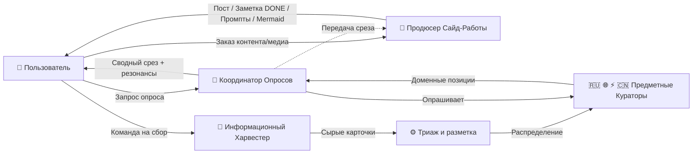
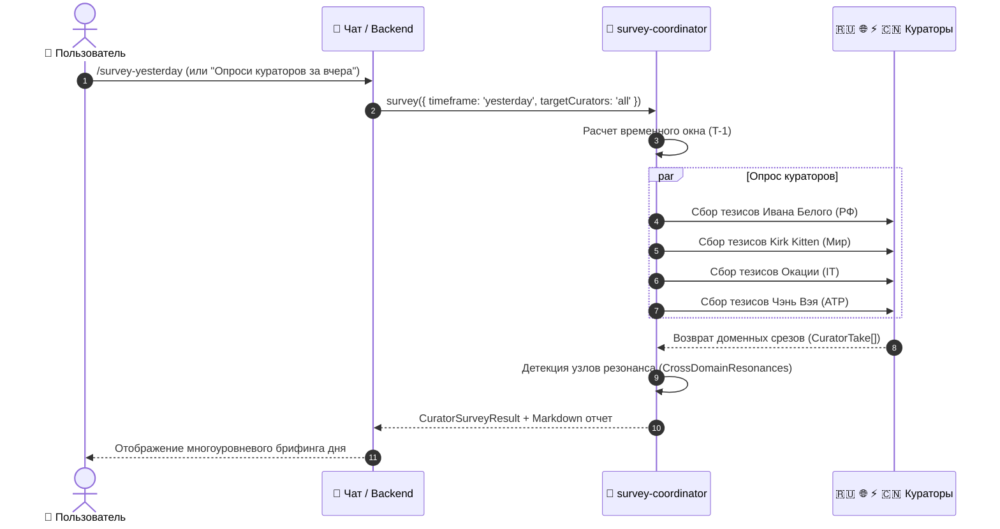
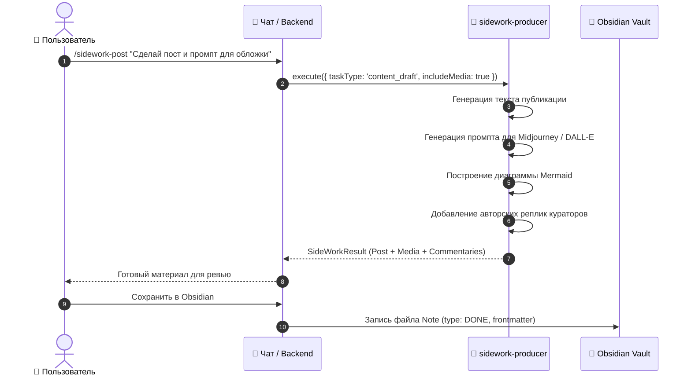

# 🍋 Архитектура Lemon Calendarium: Агентско-Кураторская Модель

> **Статус**: Официальная архитектурная спецификация (Production Architecture Specification)  
> **Версия**: 2.0.0  
> **Контекст**: Lemon Seasons / Project Lenta  
> **Ключевой фокус**: Разделение ролей Кураторов (Domain Authorities) и Агентов (Operational Workers), регламент опроса кураторов за периоды (сегодня / вчера / неделя) и конвейер сайд-работы (контент, медиа-промпты, диаграммы, комментарии).

---

## 📑 Содержание

1. [Концептуальный фундамент: Куратор vs Агент](#1-концептуальный-фундамент-куратор-vs-агент)
2. [Реестр Кураторов (Domain Curators & Lens System)](#2-реестр-кураторов-domain-curators--lens-system)
3. [Коллегии и Группы Кураторов](#3-коллегии-и-группы-кураторов)
4. [Реестр Функциональных Агентов (Operational Worker Agents)](#4-реестр-функциональных-агентов-operational-worker-agents)
5. [Архитектура Опроса Кураторов (Curator Survey Engine)](#5-архитектура-опроса-кураторов-curator-survey-engine)
6. [Архитектура Сайд-Работы (Side-Work & Content Producer)](#6-архитектура-сайд-работы-side-work--content-producer)
7. [Потоки данных и диаграммы взаимодействия (Workflows)](#7-потоки-данных-и-диаграммы-взаимодействия-workflows)
8. [Спецификация типов данных (TypeScript Contracts)](#8-спецификация-типов-данных-typescript-contracts)
9. [Интеграция с Obsidian и форматы сохранения заметок](#9-интеграция-с-obsidian-и-форматы-сохранения-заметок)
10. [Командный интерфейс (Сниппеты и команды быстрого вызова)](#10-командный-интерфейс-сниппеты-и-команды-быстрого-вызова)

---

## 1. Концептуальный фундамент: Куратор vs Агент

В ранних итерациях системы понятия «агент» и «куратор» частично смешивались. Новая архитектура фиксирует **строгое разделение ответственности**:

```
                       ┌────────────────────────────────────────┐
                       │        ПОЛЬЗОВАТЕЛЬ / РЕДАКТОР         │
                       │   (Верховный Архитектор Графа Знаний)  │
                       └───────────────────┬────────────────────┘
                                           │
         ┌─────────────────────────────────┴─────────────────────────────────┐
         ▼                                                                   ▼
┌─────────────────────────────────┐                         ┌─────────────────────────────────┐
│       ПРЕДМЕТНЫЕ КУРАТОРЫ       │                         │      ФУНКЦИОНАЛЬНЫЕ АГЕНТЫ      │
│   (Domain Authorities / Lenses) │                         │   (Operational Workers & Tasks) │
├─────────────────────────────────┤                         ├─────────────────────────────────┤
│ • Иван Белый (Внутренний РФ)    │                         │ • Информационный Харвестер      │
│ • Kirk Kitten (Мир / Санкции)   │                         │ • Координатор Опросов (Survey)  │
│ • Окация (IT & AI / Архитектура)│                         │ • Продюсер Сайд-Работы (Content)│
│ • Чэнь Вэй (АТР / БРИКС)        │                         │ • Режиссер Подкастов (Audio)    │
│                                 │                         │ • Независимый Арбитр (Synthesis)│
├─────────────────────────────────┤                         ├─────────────────────────────────┤
│ 📌 Имеют постоянный домен       │                         │ ⚙️ НЕ привязаны к одной теме    │
│ 📌 Экспертная оценка и резонанс │                         │ ⚙️ Выполняют прикладные задачи  │
│ 📌 Персона, оптика и стиль      │                         │ ⚙️ Опрашивают группы кураторов  │
│ 📌 Доменные фильтры и теги      │                         │ ⚙️ Создают посты, медиа, промпты│
└─────────────────────────────────┘                         └─────────────────────────────────┘
```

### 1.1. Кто такой Куратор?
- **Куратор** — это постоянный аналитический страж и экспертная призма в конкретной сфере жизни, науки или экономики.
- Куратор **отвечает за предметную область**: отбирает важные сигналы, отсеивает шум, формулирует авторскую позицию и рассчитывает степень резонанса событий в своем секторе.
- Куратор не пишет за пользователя технические посты для соцсетей и не занимается парсингом — он **хранит контекст своей предметной области**.

### 1.2. Кто такой Агент?
- **Агент** — это функциональный сервисный воркер (инструментальный исполнитель).
- Агент **не имеет персональной предметной области** (он не «куратор IT» и не «куратор политики»). Он решает задачи:
  1. **Сбор новостей и мониторинг источников** (Информационный Харвестер).
  2. **Опрос групп кураторов** по запросу человека («Опроси политическую коллегию за вчера», «Опроси всех кураторов за неделю»).
  3. **Сайд-работа (Side-Work)**: упаковка курированных данных в публикации, лонгриды, Telegram-посты, генерация промптов для иллюстраций (DALL-E, Midjourney), создание схем связей Mermaid и дополнение экспертными комментариями.
  4. **Аудио-продакшн**: генерация сценариев диалоговых подкастов NotebookLM.
  5. **Арбитраж и синтез**: беспристрастное сопоставление противоречивых оценок разных кураторов.

---

## 2. Реестр Кураторов (Domain Curators & Lens System)

Каждый куратор зарегистрирован в системе `@lenta/shared` с неизменяемым паспортом оптики:

| Идентификатор | Имя | Эмодзи | Предметная область (Домен) | Характер оптики | Акцентный цвет |
| :--- | :--- | :---: | :--- | :--- | :--- |
| `ivan-bely` | **Иван Белый** | 🇷🇺 | Внутренняя политика РФ, законы Госдумы, регуляторика ФАС/ЦБ, рынок топлива и демпфер, ЕДГ-2026 | Прагматичный, нормативистский, опора на первичные приказы ведомств и баланс цен | `#38bdf8` (Sky) |
| `kirk-kitten` | **Kirk Kitten** | 🌐 | США, ЕС, санкции OFAC, танкерная логистика, решения ФРС/ЕЦБ, сырьевые рынки, G7 | Острый, фактчекинг по англоязычным реестрам, биржевым индексам и комплаенс-базам | `#fbbf24` (Amber) |
| `okatsiya` | **Окация** | ⚡ | IT & AI, нейросети, BigTech, Kubernetes, DevOps, Backend, HighLoad, InfoSec, чипы | Инженерный, архитектурный, оценка масштабируемости, безопасности и open-weights моделей | `#a855f7` (Purple) |
| `chen-wei` | **Чэнь Вэй** | 🇨🇳 | Китай, АТР, БРИКС+, клиринг в нацвалютах, торговые коридоры, поставки электроники | Анализ трансграничных потоков, сухопутных и морских путей, динамики юаня | `#ef4444` (Red) |

---

## 3. Коллегии и Группы Кураторов

Кураторы могут опрашиваться как по отдельности, так и в составе институциональных коллегий (`CuratorGroup`):

1. **🏛️ Политическая коллегия (`political-group`)**:
   - **Участники**: Иван Белый, Kirk Kitten, Чэнь Вэй.
   - **Фокус**: Внутренняя стабильность РФ, санкционное давление Запада, восточный вектор торговли и расчетная архитектура БРИКС.
2. **⚡ IT & AI Совет (`tech-group`)**:
   - **Участники**: Окация.
   - **Фокус**: Архитектура высоконагруженных систем, инфраструктура дата-центров, релизы LLM и кибербезопасность.
3. **📊 Макроэкономический консилиум (`macro-group`)**:
   - **Участники**: Иван Белый, Kirk Kitten.
   - **Фокус**: Влияние решений регуляторов США/ЕС на валютный курс, топливный демпфер и инфляционные ожидания в России.
4. **🌐 Полная коллегия кураторов (`all-curators`)**:
   - **Участники**: Иван Белый, Kirk Kitten, Чэнь Вэй, Окация.
   - **Фокус**: Полная 360-градусная панорама дня, недели или выбранного исторического периода.

---

## 4. Реестр Функциональных Агентов (Operational Worker Agents)

Функциональные агенты вынесены в реестр `WORKER_AGENTS` и выполняют исполнительские процессы:



### Паспорта Агентов:

| Идентификатор | Имя | Роль | Категория | Возможности (Capabilities) |
| :--- | :--- | :--- | :--- | :--- |
| `survey-coordinator` | **Координатор Опросов** | Агент-опросчик и диспетчер коллегий | `survey` | Опрос групп за любой период (сегодня, вчера, неделя), кросс-доменное сопоставление, выявление узлов резонанса |
| `sidework-producer` | **Продюсер Сайд-Работы** | Агент контент-продакшна и медиа-обогащения | `sidework` | Написание постов и дайджестов, генерация AI-промптов для иллюстраций (DALL-E/Midjourney), создание Mermaid-диаграмм, добавление комментариев кураторов |
| `harvester-agent` | **Информационный Харвестер** | Агент сбора данных и мониторинга фидов | `ingestion` | Непрерывный опрос RSS, парсинг первоисточников, очистка от дублей, подготовка карточек на триаж |
| `podcast-producer` | **Режиссер Подкастов** | Агент генерации аудио-диалогов | `sidework` | Создание 2-хост диалоговых сценариев в стиле Google NotebookLM Audio Overview |
| `independent-analyst` | **Независимый Арбитр** | Агент беспристрастного синтеза | `synthesis` | Объективное взвешивание противоречивых тезисов кураторов без субъективных предубеждений |

---

## 5. Архитектура Опроса Кураторов (Curator Survey Engine)

### 5.1. Задача и сценарий использования
Пользователь обращается к Агенту-Опросчику (`survey-coordinator`):
> *«Опроси политическую коллегию за вчера»*  
> *«Опроси всех кураторов за неделю»*  
> *«Собери срез мнений Ивана и Окации на сегодняшнюю дату»*

### 5.2. Временные горизонты опроса (`SurveyTimeframe`)
1. **`today` (Сегодня)**: Анализ поступающих сигналов текущих суток.
2. **`yesterday` (Вчера)**: Фиксация итогов вчерашнего дня с учетом реакции ночных рынков и публикаций нормативных актов.
3. **`three_days` (3 дня)**: Оценка краткосрочного тренда и развития резонансных сюжетов.
4. **`week` (Неделя / 7 дней)**: Стратегическая панорама, выявление структурных сдвигов и подготовка к недельному планированию.
5. **`custom` (Произвольный период)**: Опрос по кастомному диапазону дат (`customStartDate` — `customEndDate`).

### 5.3. Механизм работы `CuratorSurveyAgent`:
1. **Вычисление временного окна**: Формирование интервала дат `from` — `to`.
2. **Фильтрация контекста**: Отбор всех подтвержденных и кандидатских карточек новостей за данный интервал.
3. **Генерация среза по каждому куратору (`CuratorTake`)**:
   - Число зафиксированных событийных маркеров.
   - Ключевые предметные тезисы куратора.
   - Выявленные точки напряжения и риски.
   - Перечень первоисточников.
4. **Детекция междисциплинарного резонанса (`CrossDomainResonance`)**:
   - Автоматический поиск точек пересечения между кураторами (например: «Морские санкции OFAC (Kirk) ⟷ Цены на топливо в РФ (Иван)»).
   - Расчет индекса резонанса (0–100%).
   - Формирование подсказок для перехода к сайд-работе.

---

## 6. Архитектура Сайд-Работы (Side-Work & Content Producer)

Сайд-работа — это процесс трансформации сырых данных и аналитических срезов в **готовые медиа-продукты и структурированные знания**.

### 6.1. Направления сайд-работы:

#### А. Создание контента (`CONTENT_DRAFT`)
- **Telegram-пост**: Краткий, емкий, оформленный эмодзи и хэштегами пост с акцентом на выводы.
- **Obsidian Заметка (`DONE`)**: Полноформатная структурированная заметка с Frontmatter для включения в персональную базу знаний.
- **Аналитический лонгрид / статья**: Развернутый аналитический обзор для блога, сайта или рассылки.

#### Б. Медиа-обогащение (`MEDIA_ENRICHMENT`)
- **AI Image Prompts**: Генерация точных, кинематографичных и стилистически выверенных промптов для моделей генерации изображений (DALL-E 3, Midjourney v6, Google Imagen 3) с метафорическим отображением темы.
- **Инфографика и диаграммы Mermaid**: Автоматическое построение схем логистических цепочек, финансовых переходов или IT-архитектур.
- **Карточки цитат и ключевых метрик**: Выделение главных цифр и цитат в формате Callout.

#### В. Дополнение комментарием (`EXPERT_COMMENTARY`)
- Формирование авторских врезок от лица кураторов:
  - *«Комментарий Ивана Белого: практический регуляторный аспект»*
  - *«Оценка Kirk Kitten: международный контекст и прецеденты»*
  - *«Технический комментарий Окации: риски для IT-инфраструктуры»*
- Фактчекинг и историческая справка.

---

## 7. Потоки данных и диаграммы взаимодействия (Workflows)

### Сценарий 1: Пользовательский опрос кураторов за период



### Сценарий 2: Переход от опроса к сайд-работе и публикации



---

## 8. Спецификация типов данных (TypeScript Contracts)

Контракты зафиксированы в `@lenta/shared` и переиспользуются во всех пакетах:

```typescript
// Временной охват опроса
export type SurveyTimeframe = 'today' | 'yesterday' | 'three_days' | 'week' | 'custom';

// Запрос на проведение опроса
export interface CuratorSurveyRequest {
  targetCurators?: (CuratorId | string)[] | 'all';
  groupId?: string; // 'political-group' | 'tech-group' | 'macro-group' | 'all-curators'
  timeframe: SurveyTimeframe;
  customStartDate?: string; // YYYY-MM-DD
  customEndDate?: string;   // YYYY-MM-DD
  focusTopic?: string;
}

// Позиция конкретного куратора по итогам опроса
export interface CuratorTake {
  curatorId: string;
  curatorName: string;
  emoji: string;
  domain: string;
  itemsCount: number;
  keyTheses: string[];
  resonancePoints: string[];
  sourceCitations: string[];
}

// Узел междисциплинарного резонанса
export interface CrossDomainResonance {
  title: string;
  score: number; // 0 - 100
  involvedCurators: string[];
  analysis: string;
  suggestedFollowupPrompt?: string;
}

// Результат опроса
export interface CuratorSurveyResult {
  id: string;
  timeframe: SurveyTimeframe;
  dateRange: { from: string; to: string };
  requestedCurators: string[];
  headline: string;
  executiveSummary: string;
  curatorTakes: CuratorTake[];
  crossDomainResonances: CrossDomainResonance[];
  generatedAt: string;
}

// Типы задач сайд-работы
export type SideWorkTaskType =
  | 'content_draft'      // Написание статьи, поста, заметки
  | 'media_enrichment'   // AI-промпты, диаграммы Mermaid, инфографика
  | 'expert_commentary'  // Комментарии кураторов, фактчек
  | 'digest_synthesis'   // Сводный дайджест
  | 'podcast_script';    // Сценарий подкаста

// Медиа-элемент сайд-работы
export interface SideWorkMediaItem {
  type: 'image_prompt' | 'mermaid_diagram' | 'quote_card' | 'key_stat' | 'external_media';
  title: string;
  content: string;
  aspectRatio?: string;
  suggestedCaption?: string;
  styleKeywords?: string[];
}

// Результат сайд-работы
export interface SideWorkResult {
  id: string;
  taskType: SideWorkTaskType;
  title: string;
  targetFormat: string;
  contentMarkdown: string;
  enrichedMedia: SideWorkMediaItem[];
  curatorCommentaries: {
    curatorId: string;
    curatorName: string;
    emoji: string;
    commentary: string;
  }[];
  suggestedObsidianFrontmatter?: Record<string, any>;
  createdAt: string;
}
```

---

## 9. Интеграция с Obsidian и форматы сохранения заметок

При фиксации результатов работы агента в заметку Obsidian формируется валидный YAML Frontmatter:

```yaml
---
id: "done-2026-10-01-cross-synthesis"
title: "Баланс топливного демпфера РФ и директивы OFAC"
type: "DONE"
date: "2026-10-01"
curator: "Иван Белый"
secondaryCurators:
  - "Kirk Kitten"
tags:
  - "политика"
  - "топливо"
  - "санкции"
  - "резонанс"
resonanceScore: 88
status: "COMPLETED"
sourceSurveyId: "survey-1727814000-abc12"
---

# Баланс топливного демпфера РФ и директивы OFAC

## Аналитическое резюме
...
```

---

## 10. Командный интерфейс (Сниппеты и команды быстрого вызова)

В чатах и командной строке доступны быстрые команды (пресеты):

| Команда | Описание | Назначенный Агент / Куратор |
| :--- | :--- | :--- |
| `/survey-today` | Сводный опрос кураторов по повестке дня | `survey-coordinator` |
| `/survey-yesterday`| Опрос кураторов за вчерашний день | `survey-coordinator` |
| `/survey-week` | Недельный срез трендов и коллизий | `survey-coordinator` |
| `/sidework-post` | Создание готового поста / дайджеста для публикации | `sidework-producer` |
| `/media` | Генерация AI-промптов для изображений и Mermaid-схем | `sidework-producer` |
| `/comment` | Дополнение аналитическими комментариями кураторов | `sidework-producer` |
| `/it` | Технологический срез по IT и искусственному интеллекту | `okatsiya` |
| `/ivan` | Регуляторный и экономический контур РФ | `ivan-bely` |
| `/kirk` | Международный контур, санкции OFAC и логистика | `kirk-kitten` |
| `/chen` | АТР, Китай, трансграничные коридоры и БРИКС | `chen-wei` |
| `/politics` | Совместное резюме Политической коллегии | `political-group` |
| `/synthesis` | Беспристрастный арбитраж фактов и расчет связи | `independent-analyst` |
| `/harvest` | Сбор и проверка входящих источников данных | `harvester-agent` |
