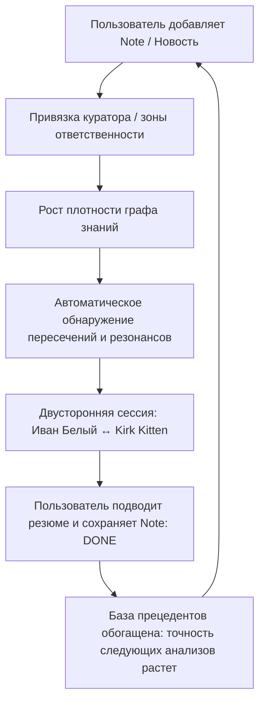

# 🍋 Lemon Calendarium — Концепция Персон-Помощников и Двустороннего Анализа (Cross-Analysis Engine)

> **Статус**: Архитектурная спецификация и концептуальный дизайн  
> **Версия**: 1.0.0  
> **Дата**: Сентябрь 2026  
> **Ключевой фокус**: Разметка зон ответственности, маховик плотности знаний, расчет процента резонанса и синтез в заметки типа `DONE`.

---

## 📑 Содержание

1. [Философия: Пользователь как Главная Призма](#1-философия-пользователь-как-главная-призма)
2. [Маховик плотности знаний (Knowledge Density Flywheel)](#2-маховик-плотности-знаний-knowledge-density-flywheel)
3. [Модель помощников-акторов (Persona & Lens Framework)](#3-модель-помощников-акторов-persona--lens-framework)
4. [Метрика пересечения и Процент Резонанса (Resonance Score)](#4-метрика-пересечения-и-процент-резонанса-resonance-score)
5. [Двусторонняя аналитическая сессия (Bilateral Commentary Session)](#5-двусторонняя-аналитическая-сессия-bilateral-commentary-session)
6. [Завершение сессии и фиксация в Note типа `DONE`](#6-завершение-сессии-и-фиксация-в-note-типа-done)
7. [Накопление практической базы и обучение системы](#7-накопление-практической-базы-и-обучение-системы)
8. [Техническая спецификация: Схема данных и Obsidian Frontmatter](#8-техническая-спецификация-схема-данных-и-obsidian-frontmatter)
9. [Пользовательский интерфейс и сценарии работы](#9-пользовательский-интерфейс-и-сценарии-работы)

---

## 1. Философия: Пользователь как Главная Призма

В центре системы Lemon Calendarium всегда находится **Пользователь — Верховный Архитектор и Арбитр своего информационного мира**.

```
                ┌───────────────────────────┐
                │        ПОЛЬЗОВАТЕЛЬ       │
                │   (Главная Призма Мира)   │
                └─────────────┬─────────────┘
                              │
               Определяет фокус, задает вопросы,
               принимает финальные выводы
                              │
             ┌────────────────┴────────────────┐
             ▼                                 ▼
   ┌───────────────────┐             ┌───────────────────┐
   │    ИВАН БЕЛЫЙ     │             │    KIRK KITTEN    │
   │  (Внутренний луч) │ ◄─────────► │  (Внешний луч)    │
   │   Оптика: Россия  │  Диалог &   │   Оптика: Мир     │
   │   Рынок, законы   │  Фактчекинг │   Санкции, рынки  │
   └─────────┬─────────┘             └─────────┬─────────┘
             │                                 │
             └────────────────┬────────────────┘
                              ▼
                ┌───────────────────────────┐
                │   СИНТЕЗ В ЗАМЕТКУ DONE   │
                │  (Практическая мудрость)  │
                └───────────────────────────┘
```

### Ключевые аксиомы:
1. **Персоны — это аналитические линзы, а не оракулы.** Они не диктуют «единственную правду» и не заменяют суждения пользователя. Они подсвечивают события под определенным углом зрения, избавляя человека от необходимости держать в голове тонкости локальных регуляций или зарубежных реестров.
2. **Суверенитет управления.** Пользователь сам решает, каким персонажам делегировать мониторинг тех или иных областей, когда запускать диалог сторон и какое итоговое резюме зафиксировать в базе знаний.
3. **Анти-пассивность.** Система поощряет не бездумное потребление инфошума («скроллинг ленты»), а активную селекцию, структурирование и подведение итогов.

---

## 2. Маховик плотности знаний (Knowledge Density Flywheel)

Качество любого аналитического вывода напрямую зависит от **плотности и размеченности контекста**.



### Зависимость «Плотность $\rightarrow$ Качество»:
- **Изолированная новость без куратора:** «В России выросли цены на бензин». Вывод тривиален, контекст утерян через неделю.
- **Новость, размеченная Иваном Белым (`curator: Иван Белый`):** фиксирует биржевые индексы СПбМТСБ, позицию ФАС и динамику выплат по демпферу.
- **Встречная новость, размеченная Kirk Kitten (`curator: Kirk Kitten`):** фиксирует решение Минфина США (OFAC) по танкерному флоту и удорожание страховых премий Lloyd’s.
- **Смысловой резонанс:** система сопоставляет обе заметки, рассчитывает процент пересечения, организует встречный комментарий и позволяет пользователю получить **объемную 3D-картину мира**.

---

## 3. Модель помощников-акторов (Persona & Lens Framework)

Каждый помощник в системе наделен паспортом, определяющим его область ответственности, используемые базы источников и характер аналитики.

| Параметр | 🇷🇺 Иван Белый | 🌐 Kirk Kitten |
| :--- | :--- | :--- |
| **Идентификатор** | `ivan-bely` | `kirk-kitten` |
| **Отображаемое имя** | **Иван Белый** | **Kirk Kitten** |
| **Роль** | Ведущий обозреватель контура РФ | Специальный зарубежный корреспондент |
| **Область ответственности** | Внутренняя политика России, выборы (ЕДГ-2026), регуляторика ФАС/ЦБ, потребительские цены, логистика внутри страны, налоги и меры господдержки | Международные рынки, решения ФРС и ЕЦБ, санкционные пакеты (OFAC, ЕС), выборы в США (Midterms 2026), глобальная торговля и морские перевозки |
| **Фиды по умолчанию** | `russian-official`, `russian-military`, `politics-2026` | `politics-2026`, `world-holidays`, `tech-strategy` |
| **Характер оптики** | Прагматичный, внимательный к конкретным нормативам, законам и реальному положению дел в регионах | Острый, быстро проверяющий факты по англоязычным реестрам, биржевым терминалам и открытым базам документов |
| **Цветовой код бейджа** | Стальной синий (`#38bdf8` / `border: #0284c7`) | Янтарно-фиолетовый (`#fbbf24` / `border: #d97706`) |
| **Символ / Иконка** | 🏛️ / `ShieldCheck` | 🐾 / `Radar` |

---

## 4. Метрика пересечения и Процент Резонанса (Resonance Score)

Для выявления пограничных ситуаций используется алгоритм вычисления **Процента Резонанса ($R \in [0..100\%]$)** между заметками разных кураторов:

$$R = w_t \cdot S_{\text{time}} + w_e \cdot S_{\text{entities}} + w_x \cdot S_{\text{taxonomy}} + w_c \cdot S_{\text{causal}}$$

Где:
1. **Временная близость ($S_{\text{time}}$, вес 25%):**  
   Пересечение дат или разница в пределах $0..7$ дней между событиями.
2. **Пересечение сущностей и ключевых слов ($S_{\text{entities}}$, вес 35%):**  
   Совпадение товарных групп (нефть, газ, полупроводники, зерно), компаний, институтов (OFAC, ФАС, ЦБ, OPEC) или хештегов (`#санкции`, `#логистика`).
3. **Таксономическая связность ($S_{\text{taxonomy}}$, вес 25%):**  
   Близость путей в иерархии `TaxonomyNode` (например, `politics.international` $\leftrightarrow$ `politics.economy`).
4. **Причинно-следственные маркеры ($S_{\text{causal}}$, вес 15%):**  
   Наличие в текстах заметок формулировок взаимного влияния («из-за», «в ответ на», «вследствие запрета», «повлекло за собой»).

### Градация резонанса в интерфейсе:

| Диапазон $R$ | Статус | Визуальный лейбл | Поведение системы |
| :---: | :---: | :---: | :--- |
| **0% – 40%** | Независимые события | — | События живут в своих лентах без связывания |
| **41% – 70%** | Фоновый контекст | `🔗 Контекст 58%` | В карточке выводится ссылка на смежное внешнее событие |
| **71% – 100%** | **Критический резонанс** | `⚡ Резонанс 89%` *(Пульсирующий бейдж)* | Заметки объединяются в кластер; предлагается запустить двустороннюю сессию |

---

## 5. Двусторонняя аналитическая сессия (Bilateral Commentary Session)

Когда два события достигают критического резонанса ($R \ge 70\%$), система активирует **Двусторонний Диалог**:

```
┌─────────────────────────────────────────────────────────────────────────────┐
│  ⚡ ПОГРАНИЧНЫЙ УЗЕЛ: Топливный баланс и морские ограничения                │
│  Резонанс: 86%  •  Период: 18–24 сентября 2026                              │
├─────────────────────────────────────────────────────────────────────────────┤
│  [🇷🇺 Иван Белый — Внутренний контур]:                                      │
│  «Биржевые цены на АИ-95 на СПбМТСБ прибавили 4.2% за три торговых дня.      │
│   НПЗ рапортуют о затоваривании экспортных резервуаров и необходимости      │
│   перенаправления цистерн на внутренние базы. Внутренний демпфер работает,  │
│   но опт давит на розничные сети независимых АЗС.»                          │
│                                                                             │
│  [🌐 Kirk Kitten — Внешний контур]:                                         │
│  «Факты подтверждены. 19 сентября Управление по контролю за иностранными    │
│   активами США (OFAC) наложило вторичные санкции на 4 судоходные компании    │
│   и 8 балкеров. Ставки фрахта в Балтийском море подскочили на 18%.          │
│   Экспортные партии физически задержались в портах погрузки, что вызвало     │
│   эффект "бутылочного горлышка" на железнодорожных подходах.»               │
│                                                                             │
│  [👑 Резюме Пользователя (Мастер-Призма)]:                                   │
│  «Скачок оптовых цен в РФ носит временный логистический характер, вызванный  │
│   санкционным шоком в портах. Ожидать нормализации через 2–3 недели по мере  │
│   задействования альтернативных танкеров под нейтральными флагами.»         │
└─────────────────────────────────────────────────────────────────────────────┘
```

---

## 6. Завершение сессии и фиксация в Note типа `DONE`

После завершения сессии пользователь нажимает кнопку **«Зафиксировать синтез»**. Система генерирует новую карточку в календаре:

* **`type`**: `DONE` (официальный системный тип для завершенных аналитических единиц).
* **`title`**: `[Синтез] Топливный баланс РФ на фоне морских ограничений OFAC`.
* **`curators`**: `["Иван Белый", "Kirk Kitten"]`.
* **`sourceNotes`**: ссылки на обе исходные заметки.
* **`resonanceScore`**: `86%`.

### Пример Markdown-файла в Obsidian Vault:

```markdown
---
lenta_id: "synth-2026-09-24-fuel-balance"
title: "[Синтез] Влияние санкций OFAC на внутренний топливный рынок РФ"
type: "DONE"
start_date: "2026-09-24T18:00:00.000Z"
end_date: null
curator: "Пользователь"
assistants:
  - "Иван Белый"
  - "Kirk Kitten"
resonance_score: 86
primary_folder: "Synthesis/2026"
folders:
  - "Synthesis/2026"
  - "Analysis/Energy"
taxonomy:
  - "politics.cross_analysis"
  - "economy.energy"
tags:
  - "синтез"
  - "бензин"
  - "санкции"
  - "демпфер"
links:
  - title: "Исходная заметка: СПбМТСБ динамика цен"
    url: "lenta://notes/note-ivan-fuel-01"
  - title: "Исходная заметка: Релиз OFAC по танкерам"
    url: "lenta://notes/note-kirk-ofac-02"
---

# [Синтез] Влияние санкций OFAC на внутренний топливный рынок РФ

## 1. Тезис внутреннего контура (Иван Белый)
- Рост оптовых цен на АИ-95 на 4.2% за 3 дня.
- Перегрузка резервуарных мощностей на НПЗ европейской части РФ.

## 2. Верификация внешнего контура (Kirk Kitten)
- Пакет санкций OFAC от 19.09.2026 против 4 операторов танкерного флота.
- Рост страховых и фрахтовых премий на 18%, временная блокировка отгрузок.

## 3. Резюме и заключение Пользователя
Краткосрочный дисбаланс вызван внешним логистическим шоком. Угрозы физического дефицита топлива в регионах РФ нет. Точка контроля — перерасчет субсидий через 14 дней.
```

---

## 7. Накопление практической базы и обучение системы

Заметки типа `DONE` выполняют важнейшую системную функцию:

1. **Библиотека прецедентов (Case-Based Memory):**  
   Когда в будущем произойдет аналогичный скачок котировок или новый санкционный пакет, алгоритм поиска сможет сказать:
   > *«В сентябре 2026 года при аналогичном резонансе 86% ситуация разрешилась за 16 дней через перенаправление маршрутов (см. [[Синтез от 24.09.2026]]).»*
2. **Повышение качества генераций и ответов:**  
   Заметки `DONE` подаются как высококачественные примеры (Few-Shot Context) при последующих сессиях.
3. **Геймификация и ценность накопления:**  
   Пользователь видит прямую отдачу: чем больше новостей он помечает кураторами, тем умнее и полезнее становится его персональный календарь.

---

## 8. Техническая спецификация: Схема данных и Obsidian Frontmatter

### 1. Расширение `LentaFrontmatter` в `@lenta/shared`:
```typescript
export interface LentaFrontmatter {
  lenta_id?: string;
  title?: string;
  type?: NoteType; // SINGLE | PERIOD | EVENT | FILM_RELEASE | MENTION | DONE
  start_date?: string;
  end_date?: string | null;

  // Поле куратора / зоны ответственности
  curator?: string;          // Основной куратор ("Иван Белый" | "Kirk Kitten")
  persona?: string;          // Алиас для curator
  assistants?: string[];     // Список вовлеченных акторов при кросс-анализе

  // Метрики резонанса для пограничных узлов
  resonance_score?: number;  // 0 - 100
  related_note_ids?: string[]; // Связанные встречные заметки

  primary_folder?: string;
  folders?: string[];
  taxonomy?: string[];
  tags?: string[];
  links?: Array<{ title?: string; url: string; is_source?: boolean }>;
  [key: string]: any;
}
```

### 2. Поддержка в Prisma Schema (`schema.prisma`):
```prisma
model Note {
  // ... существующие поля (id, feedId, title, type, startDate, endDate...)
  curator         String?    // Имя или ID куратора ("Иван Белый", "Kirk Kitten")
  resonanceScore  Int?       // Процент пересечения (0-100)
  parentNoteId    String?    // Для синтезов: ссылка на родительский узел
  
  @@index([curator])
  @@index([resonanceScore])
}
```

---

## 9. Пользовательский интерфейс и сценарии работы

### A. В карточке заметки (Timeline & Month View):
- Если у заметки есть `curator`: отображается бейдж куратора с его цветом и иконкой.
- Если вычислен высокий резонанс: карточка подсвечивается акцентной рамкой с бейджем `⚡ 86% Резонанс`. Клик на бейдж открывает встречное событие.

### B. Режим «Аналитический стол» (Workspace Split-View):
- Слева — хроника событий под кураторством **Ивана Белого**.
- Справа — хроника событий под кураторством **Kirk Kitten**.
- По центру — соединительные линии связей и кнопка **«Синтезировать в DONE»**.

### C. Фильтр по кураторам в Сайдбаре:
- Пользователь может в один клик отфильтровать календарь:
  - `[ Все ]`
  - `[ 🇷🇺 Иван Белый ]` (новости РФ)
  - `[ 🌐 Kirk Kitten ]` (международная панорама)
  - `[ ✅ Готовые синтезы (DONE) ]` (библиотека итоговых выводов)

---

## 🏁 Резюме концепции

Эта архитектура решает сразу четыре ключевые задачи:
1. **Ясность разметки:** Замена размытого `people` на четкое поле `curator` (с алиасом `persona`).
2. **Мотивация накопления:** Четкая прямая выгода — больше заметок с кураторами $\rightarrow$ выше плотность знаний $\rightarrow$ сильнее аналитика.
3. **Объективность через диалог:** Сопоставление двух специализированных взглядов (Россия $\leftrightarrow$ Мир) исключает однобокость.
4. **Суверенитет пользователя:** Человек остается главным судьей и автором итоговых заметок `DONE`, собирая свою уникальную базу знаний.
