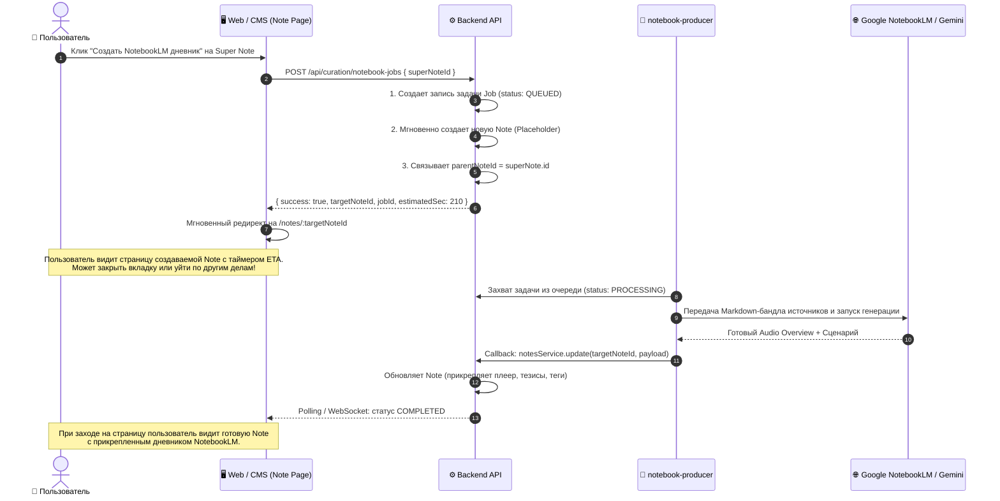

# 🍋 Спецификация: Куратор Герман «Кернел» и Агент NotebookLM

> **Статус**: Архитектурная спецификация и системный дизайн  
> **Версия**: 1.0.0  
> **Дата**: Октябрь 2026  
> **Контекст**: Lemon Calendarium (Project Lenta)  
> **Ключевой фокус**: Напарник Окации по Habr и статьям IT-сообщества, контейнер журнала «Хакер», модель Super Note ⟷ Дневник NotebookLM и асинхронный фоновый пайплайн.

---

## 📑 Содержание

1. [Портрет Куратора: Герман «Кернел» (`german-kernel`)](#1-портрет-куратора-герман-кернел-german-kernel)
2. [Разделение зон ответственности в IT-контуре](#2-разделение-зон-ответственности-в-it-контуре)
3. [Первое задание: Контейнер журнала «Хакер» и мониторинг Хабра](#3-первое-задание-контейнер-журнала-хакер-и-мониторинг-хабра)
4. [Архитектура поставки задания: Super Note ⟷ Notebook Note](#4-архитектура-поставки-задания-super-note--notebook-note)
5. [Исследование Google NotebookLM: Анализ времени и Smart ETA Engine](#5-исследование-google-notebooklm-анализ-времени-и-smart-eta-engine)
6. [Асинхронный конвейер (Job Queue & Callback Architecture)](#6-асинхронный-конвейер-job-queue--callback-architecture)
7. [Реализация в кодовой базе и команды вызова](#7-реализация-в-кодовой-базе-и-команды-вызова)

---

## 1. Портрет Куратора: Герман «Кернел» (`german-kernel`)

### 1.1. Персона и оптика
Герман — аналитический напарник Окации, представляющий живое инженерное сообщество, форумы и независимый самиздат. Он держится чуть отстраненно от корпоративного глянца и громких маркетинговых презентаций Кремниевой долины. Его стихия — **«своя кухня»**.

* **Идентификатор**: `german-kernel` *(кратко: Герман, псевдонимы: `german`, `habr`, `xakep`)*
* **Отображаемое имя**: **Герман «Кернел»** 📟
* **Роль**: Обозреватель Habr, IT-публикаций и редактор дайджестов
* **Эмодзи & Цвет**: 📟 (Terminal), акцентный изумрудный CRT-зеленый (`#10b981` / `#059669`)
* **Ключевой скилл**: 
  - Непрерывный мониторинг публикаций на **Habr** и прикладных IT-статей из сети;
  - Глубокий разбор прочитанного, выявление реального опыта практиков, архитектурных компромиссов и нестандартных инженерных решений;
  - Селекция редких олдскульных материалов (старые платы, винтажные архитектуры, схемотехника, аппаратные разборы);
  - **Упаковка в структурированные Note**: выделение тезисов, расстановка тегов, формирование как отдельных карточек статей, так и тематических кластеров (**Super Note**).

> **Примечание по профилю**: Навык низкоуровневого программирования (написание ассемблера / низкоуровневый кодинг) намеренно вынесен за скобки. Герман — в первую очередь **эрудированный IT-обозреватель, редактор и архитектор заметок**, а не исполнитель низкоуровневого кода.

---

## 2. Разделение зон ответственности в IT-контуре

В системе закреплено четкое разделение ролей:

```
┌────────────────────────────────────────────────────────────────────────────────────────┐
│                                 IT & TECH КОНТУР LENTA                                 │
├───────────────────────────────┬───────────────────────────────┬────────────────────────┤
│           ⚡ ОКАЦИЯ            │       📟 ГЕРМАН «КЕРНЕЛ»       │    🧠 БУДУЩИЙ AI-СКАУТ │
│     (Внешний / BigTech)       │     (Своя кухня / Инженерия)  │    (AI-Инструменты)    │
├───────────────────────────────┼───────────────────────────────┼────────────────────────┤
│ • Кремниевая долина & BigTech │ • Публикации на Habr          │ • Hugging Face trending│
│ • Выступления глав корпораций │ • Журнал «Хакер» (xakep.ru)   │ • Поиск новых open-    │
│   (Altman, Huang, Zuckerberg) │ • Прикладные статьи практиков │   source библиотек     │
│ • Новые модели ИИ и облака    │ • Олдскул-разборы старых плат │ • Инструменты для AI-  │
│ • Kubernetes, HighLoad        │ • Схемотехника и ретро-железо │   разработки и CLI     │
│ • Макро-тренды индустрии      │ • Сборка тематических Note    │ • Специализация на LLM │
└───────────────────────────────┴───────────────────────────────┴────────────────────────┘
```

Когда система в дальнейшем углубится в тему AI, для поиска новых нейросетевых инструментов и репозиториев Окации будет подключен третий куратор (AI-скаут). Это сохранит Германа сфокусированным на его родной стихии — статьях сообщества и олдскуле.

---

## 3. Первое задание: Контейнер журнала «Хакер» и мониторинг Хабра

### 3.1. Контейнер «Журнал Хакер (Архив & Дайджесты)»
Для упорядочивания материалов создается отдельный контейнер:
* **`Container ID`**: `container-xakep-magazine`
* **Структура папок**:
  ```text
  xakep/
  ├── 2026/
  │   ├── 09-september/
  │   │   ├── _issue-overview.md     # Общий паспорт номера
  │   │   ├── articles/              # Атомарные Note по каждой статье
  │   │   └── topics/                # Super Notes по темам (Кибербез, Кодинг, Hardware)
  │   └── 08-august/
  └── retro-archive/
  ```

### 3.2. Регламент разбора выпуска:
1. **Сбор материалов**: Ингестия содержания свежего номера и синхронизация со статьями сайта `xakep.ru`.
2. **Атомарные Note**: Каждая статья оформляется карточкой `NoteType.SINGLE` с ссылкой на оригинал, выжимкой и тегами рубрики.
3. **Формирование Super Note**: Несколько связанных статей объединяются в тематическую заметку (например, *«Кибербезопасность, xakep sep 2026»*). В ней собираются ссылки на источники и связанные Note.
4. **Передача Агенту**: Готовая Super Note передается агенту `notebook-producer` для генерации дневника в NotebookLM.

### 3.3. Мониторинг Habr и олдскульный резонанс
* Герман ежедневно отбирает статьи на Хабре, уделяя внимание не только сиюминутным новостям, но и «вечнозеленым» лонгридам (восстановление старых плат, история чипов, схемотехника).
* **Низкочастотный резонанс**: На фоне внешних инфоповодов (отключение облачных сервисов, уязвимости процессоров) Герман сопоставляет реакцию сообщества: всплеск интереса к оффлайн-сетям, ретро-железу и аналоговым протоколам.

---

## 4. Архитектура поставки задания: Super Note ⟷ Notebook Note

Вместо усложнения схемы новыми типами данных используется естественная реляционная модель:

```
┌────────────────────────────────────────────────────────┐
│              SUPER NOTE (Тема выпуска)                 │
│  Title: "Кибербезопасность, xakep sep 2026"            │
│  Type: SINGLE / DONE  •  Curator: Герман «Кернел»      │
│  Links: [xakep.ru/article-1, habr.com/post-2, ...]    │
│  Tags: #notebook-source, #кибербез, #xakep             │
└───────────────────────────┬────────────────────────────┘
                            │
               Пользователь нажимает:
         [🎙️ Создать NotebookLM дневник]
                            │
                            ▼
┌────────────────────────────────────────────────────────┐
│           NOTEBOOK NOTE (Результирующий дневник)       │
│  Title: "🎙️ Дневник: Кибербезопасность (Хакер 09/26)" │
│  parentNoteId ─────────► указывает на Super Note       │
│  Type: DONE                                            │
│  Content: Аудиоплеер + 2-Host стенограмма + конспект   │
└────────────────────────────────────────────────────────┘
```

---

## 5. Исследование Google NotebookLM: Анализ времени и Smart ETA Engine

### 5.1. Поведение Google NotebookLM
* **Публичный веб-интерфейс Google NotebookLM**: Нативный интерфейс **не возвращает точный таймер или ETA**. Пользователю демонстрируется стандартный индикатор загрузки (*«Generating Audio Overview... This usually takes a few minutes»*).
* **Google Cloud Gemini Notebook Enterprise API (`notebooks.audioOverviews.create`)**: Операция выполняется в режиме Long-Running Operation (`LRO`). При поллинге статуса возвращаются промежуточные состояния, но время завершения в секундах не передается.
* **Эмпирические замеры длительности**:
  - Индексация текстовых источников (3–8 статей): **15–30 секунд**.
  - Генерация двухголосного Audio Overview (Deep Dive): **от 2.5 до 4.5 минут** (в среднем **180–240 секунд**). Время зависит от совокупного объема слов и загруженности инфраструктуры Google.

### 5.2. Формула предиктивного расчета (Smart Heuristic ETA)
Чтобы отображать пользователю понятный прогресс, бэкенд вычисляет расчетное время перед запуском:

$$T_{\text{estimated}} = T_{\text{base}} + (k_{\text{words}} \cdot N_{\text{words}}) + T_{\text{audio}}$$

* $T_{\text{base}}$ = 20 секунд (инициализация контейнера и сессии источников);
* $k_{\text{words}} \cdot N_{\text{words}}$ = ~0.003 сек на слово (~15–20 сек для стандартного пула статей выпуска «Хакера»);
* $T_{\text{audio}}$ = 160 секунд (синтез диалога и рендеринг речи);
* **Итоговый ETA**: ~**195–210 секунд (~3.5 минуты)**.

### 5.3. Отображение в интерфейсе
1. **Прогресс-бар и фазы**:
   * `0% – 15%`: Сборка контекста и форматирование источников (MD / PDF);
   * `15% – 35%`: Индексация в ядре NotebookLM и структурирование тезисов;
   * `35% – 90%`: Генерация 2-Host аудио-диалога (таймер обратного отсчета: `Осталось ~2:30 мин`);
   * `90% – 100%`: Финализация аудиопотока и синхронизация с заметкой.
2. **Мягкая адаптация (Graceful Overrun)**:
   Если серверы Google обрабатывают запрос дольше расчетного времени, таймер не падает в ошибку, а переключается на статус:
   *«Google завершает сведение аудио... Обычно это занимает еще 30–45 секунд»*.

---

## 6. Асинхронный конвейер (Job Queue & Callback Architecture)

Проблема долгого создания (3–4 минуты) решается полным разделением пользовательского потока и фонового воркера:



---

## 7. Реализация в кодовой базе и команды вызова

### 7.1. Зарегистрированные сущности:
* **Куратор**: `german-kernel` в `@lenta/shared` (`CURATOR_PERSONAS`, `CURATOR_GROUPS['tech-group']`, `CURATOR_GROUPS['all-curators']`).
* **Воркер-агент**: `notebook-producer` в реестре `WORKER_AGENTS`.
* **Быстрые команды в чатах и CMS**:
  - `/german` — Обзор IT-статей и публикаций Habr от Германа;
  - `/habr` — Аналитический разбор свежих публикаций Habr с выделением олдскул-тем;
  - `/xakep` — Разбор материалов выпуска журнала «Хакер» (xakep.ru) и сборка Super Note;
  - `/notebook` — Фоновый запуск генерации дневника NotebookLM с расчетом ETA.
