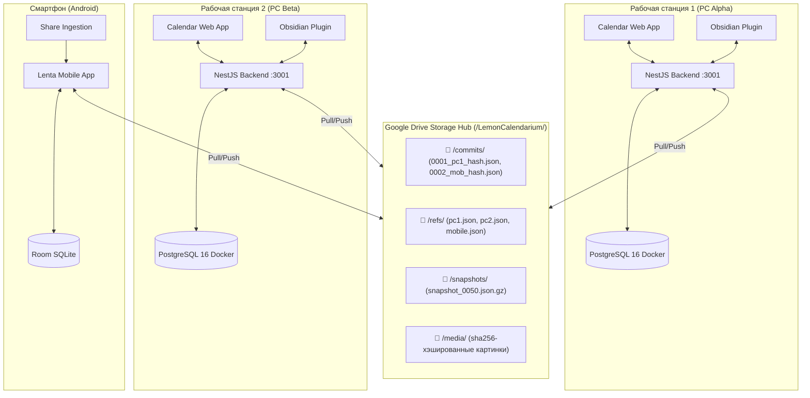
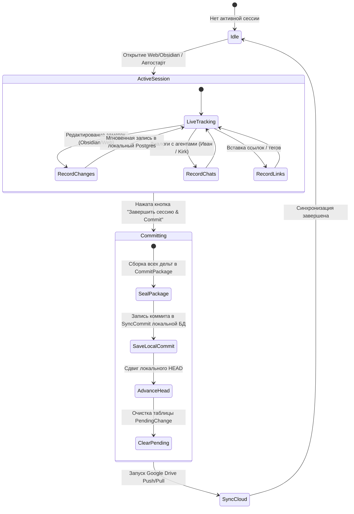

# 🍋 Lemon Calendarium — Спецификация Распределенной Синхронизации через Google Drive и Сессионного Версионирования

> **Статус**: Архитектурная спецификация и план реализации  
> **Версия**: 1.0.0  
> **Дата**: Сентябрь 2026  
> **Контекст**: Multi-Device Offline-First (2 ПК + Мобильное приложение + Obsidian + Web) без выделенного публичного сервера.

---

## 📑 Содержание

1. [Введение и архитектурные цели](#1-введение-и-архитектурные-цели)
2. [Архитектурный выбор (ADR): База данных и модель синхронизации](#2-архитектурный-выбор-adr-база-данных-и-модель-синхронизации)
3. [Топология системы и структура Google Drive](#3-топология-системы-и-структура-google-drive)
4. [Модель сессий рабочей станции (Live Session & Commit)](#4-модель-сессий-рабочей-станции-live-session--commit)
5. [Схема данных и контракты коммитов (CommitPackage)](#5-схема-данных-и-контракты-коммитов-commitpackage)
6. [Движок слияния и разрешения конфликтов (3-Way Merge)](#6-движок-слияния-и-разрешения-конфликтов-3-way-merge)
7. [Мобильное приложение (Android Ingestion Hub)](#7-мобильное-приложение-android-ingestion-hub)
8. [Интеграция с Obsidian Vault](#8-интеграция-с-obsidian-vault)
9. [Компактизация истории и снапшоты (Snapshots)](#9-компактизация-истории-и-снапшоты-snapshots)
10. [Детальный план реализации по этапам](#10-детальный-план-реализации-по-этапам)

---

## 1. Введение и архитектурные цели

### Контекст
Проект Lemon Calendarium развивается для использования на нескольких устройствах:
* **2 рабочих компьютера**: основная разработка, ведение заметок в Obsidian, работа в веб-приложении (календарь, таймлайн, админка), аналитические сессии с агентами-помощниками (Иван Белый, Kirk Kitten, Окация).
* **Мобильные устройства (Android)**: сбор ссылок, новостей, быстрых заметок из браузера и лент в режиме Offline-First.
* **Сетевое ограничение**: отсутствие выделенного 24/7 сервера в интернете, статических IP-адресов и сложных VPN-туннелей между устройствами. Устройства должны работать независимо и обмениваться данными через облачное хранилище **Google Drive**.

### Ключевые требования:
1. **Offline-First на всех клиентах**: любое устройство доступно для чтения и записи даже при полном отсутствии интернета.
2. **Сессионное версионирование на весь компьютер**: на рабочей машине сессия является общей для браузера, Obsidian и бэкенда. Во время работы действует Live-режим. В конце сессии пользователь фиксирует результат («коммит»), который уходит в облако.
3. **Безопасность и целостность данных**: отсутствие перезаписи чужих правок, неразрушающее слияние (Zero-Data-Loss), сохранение истории коммитов.

---

## 2. Архитектурный выбор (ADR): База данных и модель синхронизации

### 2.1. Локальная база данных на рабочем ПК: PostgreSQL в Docker
* **Выбор**: **PostgreSQL 16 в Docker** (через существующий `docker-compose.yml` на порту 5433).
* **Обоснование**:
  * В кодовой базе Lemon Calendarium уже реализована Prisma-схема, миграции и расширение `ltree` для иерархических путей таксономии.
  * Docker Compose гарантирует идентичность окружения и версий расширений на обоих рабочих компьютерах (Windows/macOS/Linux).
  * Локальный бэкенд NestJS (`localhost:3001`) связывает PostgreSQL, веб-приложение (`localhost:5173/5174`) и Obsidian Plugin (`@lemon/obsidian-lenta-plugin`), обеспечивая **единую сессию на весь компьютер**.
* **Альтернатива (на будущее)**: локальная служба PostgreSQL 16 в Windows для экономии оперативной памяти (без запуска Docker Desktop).

### 2.2. Модель версионирования: Event-Sourced ChangeSets (Git-модель над Google Drive)
* **Выбор**: **DAG коммитов (Directed Acyclic Graph)**, где сессия пользователя компилируется в неизменяемый JSON-файл дельт.
* **Обоснование**:
  * Google Drive — это файловое блочное хранилище с сетевой задержкой 100–400 мс. Попытка синхронизировать единый «живой» файл SQLite или том базы приведет к блокировкам и дубликатам `conflict copy`.
  * Неизменяемые файлы коммитов (`commits/<id>.json`) атомарно загружаются и скачиваются. Каждое устройство хранит указатель на текущую вершину (HEAD) и накладывает недостающие коммиты в локальную БД.

---

## 3. Топология системы и структура Google Drive



### Структура директории в Google Drive:
```
📂 LemonCalendarium/
├── 📂 commits/                        # Атомарные неизменяемые пакеты дельт
│   ├── 0001_pc1_e2a1b9c0.json
│   ├── 0002_mobile_98fd11a4.json
│   └── 0003_pc2_54a32c77.json
├── 📂 refs/                           # Указатели актуального HEAD каждого узла
│   ├── pc1.json                       # { "deviceId": "pc1", "head": "0001_...", "syncedAt": "..." }
│   ├── pc2.json                       # { "deviceId": "pc2", "head": "0003_...", "syncedAt": "..." }
│   └── mobile.json                    # { "deviceId": "mobile", "head": "0002_...", "syncedAt": "..." }
├── 📂 snapshots/                      # Консолидированные слепки (каждые 50-100 коммитов)
│   └── snapshot_0050.json.gz
└── 📂 media/                          # Бинарные вложения (изображения по sha256)
    └── 3f8a9c...jpg
```

---

## 4. Модель сессий рабочей станции (Live Session & Commit)

На рабочей машине в любой момент времени существует **активная сессия (`Active Workstation Session`)**:



---

## 5. Схема данных и контракты коммитов (CommitPackage)

### 5.1. Дополнения к локальной схеме PostgreSQL (`schema.prisma`):

```prisma
model SyncSession {
  id          String         @id @default(uuid())
  title       String
  deviceId    String
  author      String
  status      String         @default("ACTIVE") // ACTIVE, COMMITTED, CANCELLED
  startedAt   DateTime       @default(now())
  closedAt    DateTime?
  summary     String?
  changes     PendingChange[]
  commit      SyncCommit?

  @@index([status])
  @@index([deviceId])
}

model PendingChange {
  id          String       @id @default(uuid())
  sessionId   String
  session     SyncSession  @relation(fields: [sessionId], references: [id], onDelete: Cascade)
  entityType  String       // NOTE, CHAT_THREAD, CHAT_MESSAGE, LINK, FOLDER, TAG
  entityId    String
  action      String       // UPSERT, DELETE
  payload     Json
  createdAt   DateTime     @default(now())

  @@index([sessionId])
  @@index([entityType, entityId])
}

model SyncCommit {
  id              String       @id // Хеш / UUID коммита
  parentCommitIds String[]     @default([])
  deviceId        String
  author          String
  sessionId       String?      @unique
  session         SyncSession? @relation(fields: [sessionId], references: [id])
  summary         String?
  entitiesCount   Int          @default(0)
  payloadJson     Json         // Полный запечатанный пакет изменений
  isPushed        Boolean      @default(false)
  createdAt       DateTime     @default(now())

  @@index([deviceId])
  @@index([createdAt])
}
```

### 5.2. Спецификация `CommitPackage` (JSON в `commits/<id>.json`):

```typescript
export interface CommitPackage {
  commitId: string;
  parentCommitIds: string[];
  deviceId: string;
  author: string;
  timestamp: string; // ISO 8601
  session: {
    sessionId: string;
    title: string;
    summary?: string;
  };
  changes: {
    notes?: Array<{
      action: 'UPSERT' | 'DELETE';
      id: string;
      version: number;
      data?: Partial<NotePayload>;
    }>;
    chatThreads?: Array<{
      action: 'UPSERT' | 'DELETE';
      id: string;
      data?: Partial<ChatThreadPayload>;
    }>;
    chatMessages?: Array<{
      action: 'INSERT';
      id: string;
      threadId: string;
      sender: string;
      senderName: string;
      senderRole: string;
      text: string;
      createdAt: string;
      resonanceScore?: number;
      sources?: string[];
    }>;
    links?: Array<{
      action: 'INSERT' | 'DELETE';
      id: string;
      url: string;
      title?: string;
      noteId?: string;
    }>;
    folders?: Array<{
      action: 'UPSERT' | 'DELETE';
      id: string;
      path: string;
      name: string;
    }>;
  };
}
```

---

## 6. Движок слияния и разрешения конфликтов (3-Way Merge)

При выполнении операции `PULL` локальный бэкенд находит коммиты других устройств, отсутствующие локально.

```
       Предок (Common Base: Commit A)
                /            \
               /              \
  Ветка ПК 1 (Commit B)   Ветка ПК 2 / Мобилки (Commit C)
               \              /
                \            /
          Слияние (Merge Result: Commit D)
```

### Правила слияния по типам сущностей:

| Тип данных | Характер изменений | Стратегия слияния | Конфликтность |
| :--- | :--- | :--- | :--- |
| **Сообщения чатов (`ChatMessageRecord`)** | Добавление реплик диалога | Чистый **Append-Only** по `(threadId, createdAt)`. Реплики агентов и пользователя встраиваются в хронологическом порядке. | 0% (Бесконфликтно) |
| **Ссылки и новости (`NoteLink`)** | Сбор ссылок со смартфона/ПК | **Set Union** по URL/UUID. Дубликаты дедуплицируются. | 0% (Бесконфликтно) |
| **Папки и таксономия (`Folder`, `TaxonomyNode`)** | Создание/переименование каталогов | Слияние деревьев по `path`. | Минимальная |
| **Метаданные заметок (теги, даты, статус)** | Изменение полей заметки | **Полевое слияние (Field-level LWW)**: побеждает значение с более свежей временной меткой. | Автоматически |
| **Тело заметки (Markdown text)** | Редактирование текста | **3-Way Text Merge (`diff3`)**: если правки в разных абзацах — авто-слияние. Если в одной строке — генерация блока конфликта `[Conflict: ...]`. Данные **никогда не удаляются**. | Разрешается с сохранением обеих версий |

---

## 7. Мобильное приложение (Android Ingestion Hub)

Приложение на Android (`apps/mobile-android`) решает задачу быстрого сбора информации «на ходу»:

1. **Режим сбора (Capture)**:
   * Вызов системного меню Android **Share Sheet** из Chrome / Telegram / YouTube.
   * Мгновенная запись ссылки, заголовка и краткой заметки в локальный Room SQLite (`PendingShareDao`).
   * Работает без сети на 100%.
2. **Фоновый синк (WorkManager)**:
   * Периодический `SyncWorker` при наличии Wi-Fi/интернета:
     * Упаковывает все накопленные `PendingShare` в компактный `CommitPackage` с меткой устройства `deviceId: "android-mobile"`.
     * Загружает файл коммита в `/commits/` на Google Drive.
     * Обновляет `/refs/mobile.json`.
3. **Легковесный Pull**:
   * Смартфон скачивает только метаданные заметок (заголовок, дата, тип `DONE`, ссылки), позволяя искать и просматривать информацию без загрузки гигабайтов вложений.

---

## 8. Интеграция с Obsidian Vault

Плагин Obsidian (`packages/obsidian-plugin`) взаимодействует с локальным бэкендом через уже существующий `LentaApiClient` и `LentaSyncLedgerManager`:
1. При изменении Markdown-файла в хранилище плагин отсылает дельту в локальный бэкенд (`localhost:3001`).
2. Локальный бэкенд связывает изменение с текущей активной `SyncSession`.
3. В сайдбаре Obsidian отображается статус текущей сессии: *«Активная сессия: 5 файлов изменено»*.
4. Нажатие кнопки «Закоммитить» в Obsidian или в веб-интерфейсе запечатывает единый коммит.

---

## 9. Компактизация истории и снапшоты (Snapshots)

Чтобы новое устройство не скачивало тысячи файлов коммитов:
1. **Порог компактизации**: каждые 50 коммитов узел, создающий юбилейный коммит, генерирует полный дамп базы `snapshot_<commitId>.json.gz` и помещает его в `/snapshots/`.
2. **Инициализация нового устройства**:
   * Скачивается самый свежий файл из `/snapshots/`.
   * Накатываются только коммиты, выпущенные *после* этого снапшота.
   * Время первого запуска сокращается с минут до секунд.

---

## 10. Детальный план реализации по этапам

### 📍 Фаза 1: Контракты и схема данных сессий (Shared & Backend)
- [ ] **1.1 (`packages/shared`)**: Описать типы `CommitPackage`, `PendingChangePayload`, `SyncRef`, `SyncStatusResponse`.
- [ ] **1.2 (`apps/backend/prisma`)**: Добавить модели `SyncSession`, `PendingChange`, `SyncCommit` в `schema.prisma`.
- [ ] **1.3 (`apps/backend`)**: Создать и применить Prisma-миграцию `add_sync_sessions_and_commits`.

### 📍 Фаза 2: Google Drive API адаптер (Storage Hub)
- [ ] **2.1 (`apps/backend`)**: Модуль `GoogleDriveAuthService`: локальное сохранение OAuth2 токенов в `~/.lemon/gdrive-auth.json`.
- [ ] **2.2 (`apps/backend`)**: Реализовать эндпоинты `/api/sync/gdrive/auth-url` и `/api/sync/gdrive/callback` для привязки аккаунта Google.
- [ ] **2.3 (`apps/backend`)**: Модуль `GoogleDriveStorageClient`: методы `ensureFolder`, `uploadCommit`, `fetchCommitsSince`, `updateRef`.

### 📍 Фаза 3: Движок слияния и коммитов (Sync Engine)
- [ ] **3.1 (`apps/backend/src/sync`)**: `SessionService`: управление жизненным циклом сессии (`startSession`, `recordChange`, `sealCommit`).
- [ ] **3.2 (`apps/backend/src/sync`)**: `MergeService`: алгоритм 3-way слияния заметок с использованием `diff3`, слияние чатов и ссылок.
- [ ] **3.3 (`apps/backend/src/sync`)**: Фоновый планировщик синхронизации (Cron / On-demand Push & Pull).

### 📍 Фаза 4: Пользовательский интерфейс сессий (Web & Obsidian)
- [ ] **4.1 (`apps/admin-cms` & `apps/calendar-app`)**: Плашка активной сессии в шапке с индикатором числа правок.
- [ ] **4.2 (UI)**: Модальное окно «Зафиксировать сессию и отправить в Google Drive» с полем описания сессии.
- [ ] **4.3 (`packages/obsidian-plugin`)**: Подключение плагина к сессионным эндпоинтам локального бэкенда.

### 📍 Фаза 5: Мобильное приложение (Android Offline Hub)
- [ ] **5.1 (`apps/mobile-android`)**: Подключение Google Drive REST API клиента на Android.
- [ ] **5.2 (`apps/mobile-android`)**: Сборка пачки `PendingShare` в формат `CommitPackage`.
- [ ] **5.3 (`apps/mobile-android`)**: `SyncWorker` в Android WorkManager для периодического сброса ссылок в Google Drive.

### 📍 Фаза 6: Снапшоты и стабилизация
- [ ] **6.1**: Создание механизма создания и восстановления из `snapshot_<N>.json.gz`.
- [ ] **6.2**: Тестирование распределенного сценария (ПК 1 коммитит → Мобилка пушит ссылку → ПК 2 подтягивает всё без конфликтов).
