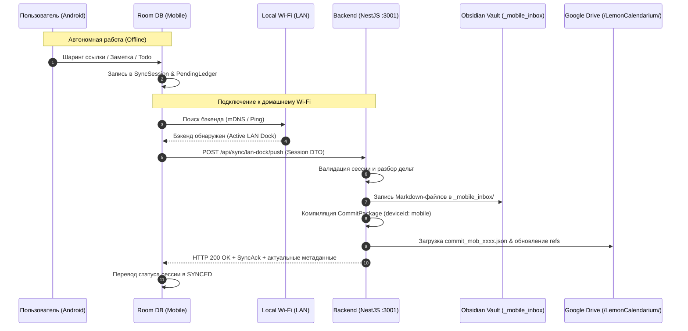
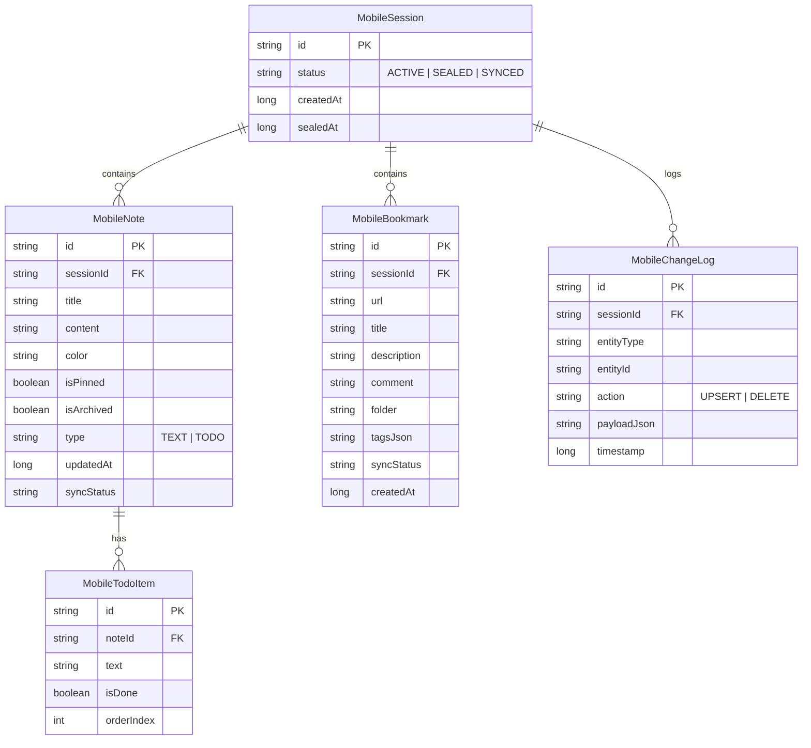

# 🍋 Lemon Calendarium — Спецификация Мобильного Приложения (Android) & Архитектура LAN Docking

> **Версия**: 1.1.0  
> **Дата**: Октябрь 2026  
> **Статус**: Утверждена архитектура LAN Docking; голосовые заметки исключены; фокус на Offline-First, Google Keep UX и выделенном Obsidian-контейнере.

---

## 📑 Содержание

1. [Архитектурная модель: LAN Docking Station](#1-архитектурная-модель-lan-docking-station)
2. [Изоляция данных: Мобильный контейнер и структура Obsidian Vault](#2-изоляция-данных-мобильный-контейнер-и-структура-obsidian-vault)
3. [Спецификация модулей и список фич (Feature Backlog)](#3-спецификация-модулей-и-список-фич-feature-backlog)
   - [3.1. Модуль закладок (Offline Bookmarks & Share Sheet)](#31-модуль-закладок-offline-bookmarks--share-sheet)
   - [3.2. Модуль заметок и списков дел (Google Keep UI/UX)](#32-модуль-заметок-и-списков-дел-google-keep-uiux)
   - [3.3. Модуль сессий и локального леджера (Mobile Sessions & Room DB)](#33-модуль-сессий-и-локального-леджера-mobile-sessions--room-db)
   - [3.4. Модуль локального сетевого коннектора (LAN Sync Engine)](#34-модуль-локального-сетевого-коннектора-lan-sync-engine)
   - [3.5. Модуль Obsidian Pipeline & Google Drive Push на бэкенде](#35-модуль-obsidian-pipeline--google-drive-push-на-бэкенде)
4. [Схема данных мобильного клиента (Room SQLite)](#4-схема-данных-мобильного-клиента-room-sqlite)
5. [UX/UI Спецификация (Google Keep Design Guidelines)](#5-uxui-спецификация-google-keep-design-guidelines)
6. [Этапы реализации и дорожная карта (Roadmap)](#6-этапы-реализации-и-дорожная-карта-roadmap)

---

## 1. Архитектурная модель: LAN Docking Station

### Почему LAN Docking решает проблему авторизации:
При прямой работе с Google Drive на Android возникает необходимость прохождения строгой OAuth2-авторизации для Restricted Scope (`drive` / `drive.file`), привязки SHA-1 отпечатков в Google Cloud Console и постоянного обновления токенов в мобильной ОС.

В модели **LAN Docking Station**:
* Смартфон **не взаимодействует с Google Drive напрямую** и не содержит Google SDK.
* Вся работа вне дома происходит **на 100% автономно** (Offline-First в локальной SQLite/Room).
* При нахождении в одной локальной Wi-Fi сети со станцией бэкенда (`NestJS :3001` на ПК), мобильное приложение производит сопряжение по защищенному локальному REST API.
* **Бэкенд на ПК выступает единым шлюзом авторизации**:
  1. Принимает мобильный сессионный пакет дельт.
  2. Раскладывает изменения в локальную БД Postgres и файлы Obsidian Vault.
  3. Упаковывает дельты в `CommitPackage` с меткой `deviceId: "android-mobile"`.
  4. Авторизованно пушит коммит в Google Drive (`/LemonCalendarium/commits/`) через свои действующие токены.
  5. Отдает смартфону подтверждение синка и обновленные метаданные.



---

## 2. Изоляция данных: Мобильный контейнер и структура Obsidian Vault

Чтобы мобильные заметки и ссылки не засоряли основную аналитическую базу десктопа до их ручной или агентской обработки, выделяется отдельный контейнер/директория:

* **Контейнер**: `mobile-intake` (внутренний ID: `cnt-mobile-inbox`).
* **Корневая папка в Vault**: `_mobile_inbox/`

```
📁 _mobile_inbox/
├── 📁 bookmarks/                  # Сохраненные веб-страницы и статьи
│   └── 2026-10-02_habr_rust.md
├── 📁 notes/                      # Текстовые заметки Keep
│   └── 2026-10-02_idea_ai_lens.md
├── 📁 todos/                      # Чек-листы и списки задач
│   └── 2026-10-02_buy_groceries.md
└── 📄 mobile_session_ledger.md    # Сводный журнал мобильных фиксаций
```

### Формат Markdown-файла заметки:
```markdown
---
id: "mob-nt-91f8c12a"
title: "Идея по оптимизации синка"
type: "mobile_note"
color: "lemon_yellow"
isPinned: true
tags: ["arch", "mobile"]
createdAt: "2026-10-02T14:32:00.000Z"
sessionRef: "mob-sess-20261002-01"
---
Текст заметки с поддержкой Markdown...
```

---

## 3. Спецификация модулей и список фич (Feature Backlog)

### 3.1. Модуль закладок (Offline Bookmarks & Share Sheet)
* **FEAT-BM-01: Системный перехват Android Share Sheet**
  * Регистрация `IntentFilter` для `ACTION_SEND` (mime-types `text/plain`, `text/html`).
  * Модальное всплывающее окно (Bottom Sheet) с автозаполнением URL и заголовка.
* **FEAT-BM-02: Офлайн-сохранение и экстракция метаданных**
  * Сохранение в Room DB без ожидания сетевого ответа.
  * Если сеть есть: фоновая попытка скачать OpenGraph (Title, Description, Image URL).
  * Если сети нет: дефолтный заголовок из домена (с возможностью дообогащения на бэкенде).
* **FEAT-BM-03: Экран просмотра закладок**
  * Хронологический список с карточками (превью, фавиконка, домен, персональный комментарий).
  * Индикатор синхронизации (Локально / Синхронизировано).
  * Поиск по URL, заголовкам и тегам.
  * Быстрые действия: открыть во внешнем браузере, скопировать ссылку, редактировать, удалить.

---

### 3.2. Модуль заметок и списков дел (Google Keep UI/UX)
* **FEAT-KP-01: Двухколоночный Masonry Grid (Сетка Keep)**
  * Адаптивная верстка с карточками переменной высоты.
  * Переключение между плиткой и одиночным списком.
* **FEAT-KP-02: Цветовое кодирование карточек**
  * Палитра из 8 фирменных пастельных цветов (Default Slate/Dark, Lemon Yellow, Sage Green, Coral Pink, Sky Blue, Lavender, Desert Sand, Deep Charcoal).
  * Сохранение выбранного цвета в метаданных заметки.
* **FEAT-KP-03: Интерактивный Todo List (Чек-лист)**
  * Чекбоксы с мгновенной реакцией и перечеркиванием текста.
  * Блок «Выполненные пункты» (сворачиваемый, внизу карточки).
  * Добавление пунктов нажатием Enter на клавиатуре.
  * Drag-and-drop сортировка элементов.
* **FEAT-KP-04: Закрепление (Pin/Unpin)**
  * Разделение главного экрана на секции: «Закрепленные» (Pinned) и «Другие» (Others).
* **FEAT-KP-05: Быстрая нижняя панель (Bottom Create Bar)**
  * Закрепленный внизу экранный бар:
    * Текстовое поле «Заметка...» для ввода в один тап.
    * Кнопка «Новый список Todo» (`CheckBoxIcon`).
    * Кнопка «Вставить ссылку из буфера» (`LinkIcon`).

---

### 3.3. Модуль сессий и локального леджера (Mobile Sessions & Room DB)
* **FEAT-SES-01: Мобильная сессия (Draft Session Lifecycle)**
  * Все новые сущности привязываются к открытой `MobileSession`.
  * Сессия переходит в статус `SEALED` перед отправкой на бэкенд.
* **FEAT-SES-02: Лог изменений (Change Ledger)**
  * Запись событий `UPSERT` / `DELETE` для заметок, пунктов todo и закладок.
  * Идемпотентные UUID сущностей для исключения дубликатов.

---

### 3.4. Модуль локального сетевого коннектора (LAN Sync Engine)
* **FEAT-LAN-01: Автообнаружение бэкенда в локальной сети**
  * Сканирование локальной подсети (mDNS/Zeroconf сервис `_lemon-lenta._tcp` или быстрый пинг известных хостов).
  * Запоминание последнего успешного IP-адреса.
* **FEAT-LAN-02: Индикатор статуса подключения (LAN Status Indicator)**
  * Зеленый: бэкенд доступен в LAN.
  * Желтый: идет передача сессионного пакета.
  * Серый: офлайн (рабочая станция выключена или вне зоны Wi-Fi).
* **FEAT-LAN-03: Ручной и фоновый синк**
  * Кнопка «Sync Now» в шапке приложения.
  * Фоновый `WorkManager` при подключении к домашнему Wi-Fi SSID.
* **FEAT-LAN-04: Редактируемый Backend URL & Поддержка внешних серверов**
  * Полноценное редактируемое поле ввода URL бэкенда в настройках (с валидацией протоколов `http://` и `https://`, порта и пути).
  * Бесшовное переключение: при появлении настоящего публичного домена (Production URL, Cloudflare Tunnel, Tailscale или VPS) пользователь просто меняет адрес в настройках без потери локальных данных в Room.
  * Кнопка «Test Connection» с мгновенной проверкой доступности (HTTP Healthcheck, время отклика в мс, детальный вывод ошибок).
  * Сохранение истории/пресетов адресов (быстрое переключение между `Локальный ПК (LAN)` и `Внешний сервер (Cloud)`).


---

### 3.5. Модуль Obsidian Pipeline & Google Drive Push на бэкенде
* **FEAT-SRV-01: Эндпоинт приема мобильной док-сессии**
  * `POST /api/sync/lan-dock/push`: прием пакета `MobileDockPayloadDto`.
* **FEAT-SRV-02: Obsidian Writer**
  * Автоматическое создание/обновление `.md` файлов в папке `_mobile_inbox/` с сохранением цветов и метаданных.
* **FEAT-SRV-03: Google Drive Publisher**
  * Формирование коммита `000x_mobile_<hash>.json` и отправка в облако через существующую подсистему сессионного версионирования ПК.

---

## 4. Схема данных мобильного клиента (Room SQLite)



---

## 5. UX/UI Спецификация (Google Keep Design Guidelines)

1. **Цветовая палитра карточек (Dark & Light Mode)**:
   * **Slate Base** (`#1E293B`) — Базовая темная карточка.
   * **Lemon Accent** (`#FEF08A` / `#CA8A04`) — Акцентный лимонный цвет бренда.
   * **Pastel Yellow** (`#3B341F` в Dark / `#FEF9C3` в Light).
   * **Sage Green** (`#1C3329` в Dark / `#DCFCE7` в Light).
   * **Coral Rose** (`#3B1F24` в Dark / `#FFE4E6` в Light).
   * **Sky Blue** (`#1E2E3E` в Dark / `#E0F2FE` в Light).
   * **Lavender** (`#2B1E3E` в Dark / `#F3E8FF` в Light).
2. **Типографика и элементы**:
   * Скругление карточек: `16.dp` (мягкий органический контур Material 3).
   * Плитка: `StaggeredVerticalGrid` (2 колонки) с отступами `8.dp`.
   * Зачеркивание выполненных задач с плавным полупрозрачным `alpha = 0.5f`.

---

## 6. Этапы реализации и дорожная карта (Roadmap)

| Этап | Задачи | Срок / Приоритет |
| :--- | :--- | :--- |
| **Этап 1: Офлайн-ядро и Keep UI** | Реализация Room DB (Note, TodoItem, Bookmark, Session). Разработка Jetpack Compose Masonry Grid, палитры цветов Keep и интерактивных чек-листов. | **P0 (Базовый MVP)** |
| **Этап 2: Закладки & Share Sheet** | Перехват `ACTION_SEND`, сохранение ссылок, экран просмотра списка закладок с поиском. | **P0 (Базовый MVP)** |
| **Этап 3: LAN Docking коннектор** | Обнаружение NestJS в LAN, упаковка сессии, отправка по REST, обработка подтверждений синка. | **P1 (Синхронизация)** |
| **Этап 4: Бэкенд-шлюз & Obsidian Inbox** | Создание эндпоинта `/api/sync/lan-dock/push`, генерация файлов в `_mobile_inbox/` и пуш коммита в Google Drive. | **P1 (Интеграция)** |
