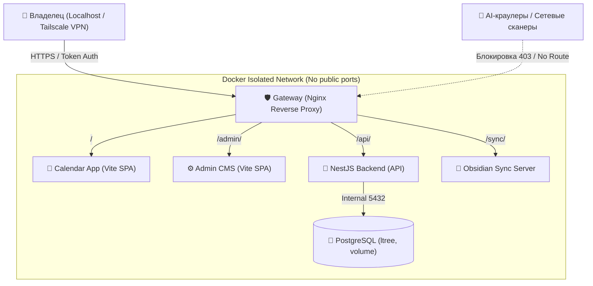
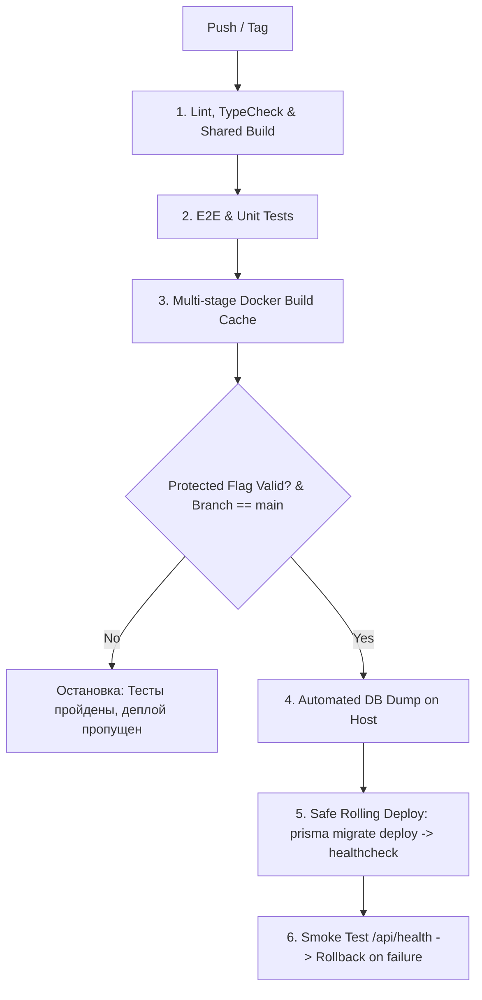

# 🛡️ Архитектурный план: Единый защищенный продакшен-билд и безопасный CI/CD

> **Проект:** Lemon My Seasons / Project Lenta (Local-First Calendar, Admin CMS & Obsidian Sync)  
> **Цель:** Подготовить изолированный Docker-стек «все в одном» для персонального использования, исключить утечку личных данных и индексацию AI-анализаторами, обеспечить надежный CI/CD без риска повреждения базы данных.

---

## 1. Архитектура: Единая точка входа («Один билд / Единый шлюз»)

В текущей конфигурации сервисы работают на 5 разрозненных портах (`5174` Calendar, `5173` Admin, `3001` Backend, `3000` Sync, `5433` Postgres), что создает избыточную поверхность атаки.

### Целевая топология
Все внутренние контейнеры закрываются во внутренней Docker-сети (`internal: true` / без проброса портов наружу). Единственная точка входа — **Unified Reverse Proxy (Nginx/Caddy)**:



### Преимущества единого шлюза:
1. **PostgreSQL и Backend не имеют открытых портов наружу (`ports` -> `expose`)**: доступ к БД возможен только внутри Docker-сети.
2. **Отсутствие CORS-проблем**: фронтенды и бэкенд обращаются по единому домену/хосту через относительные пути (`/api/notes`, `/sync`).
3. **Единая линия обороны**: правила авторизации, заголовки безопасности и фильтрация ботов настраиваются централизованно в одном месте.

---

## 2. Модель изоляции и защита от сторонних AI-анализаторов

Так как в приложении хранятся персональные записи, расписание и заметки Obsidian, защита строится по принципу эшелонированной обороны (Defense-in-Depth).

### Уровень 1: Сетевая невидимость (Stealth Mode)
- **Привязка только к Loopback / VPN**: 
  - На сервере/хосте прокси слушает исключительно `127.0.0.1:8080` (для локального ПК) либо виртуальный IP **Tailscale / WireGuard** (для доступа с телефона/ноутбука из любой точки мира).
  - Порты **никогда не биндятся на `0.0.0.0`**. Внешний интернет не имеет физического сетевого маршрута к контейнерам.

### Уровень 2: Блокировка AI-ботов и скраперов (HTTP Layer)
1. **Агрессивный `robots.txt`**:
   Запрет индексации для всех поисковиков и персональный бан известных краулеров AI:
   ```txt
   User-agent: *
   Disallow: /

   User-agent: GPTBot
   User-agent: ChatGPT-User
   User-agent: CCBot
   User-agent: anthropic-ai
   User-agent: Claude-Web
   User-agent: PerplexityBot
   User-agent: Bytespider
   User-agent: Google-Extended
   User-agent: FacebookBot
   User-agent: Diffbot
   Disallow: /
   ```
2. **HTTP Security Headers**:
   - `X-Robots-Tag: noindex, nofollow, noarchive, nosnippet, noimageindex` (запрещает сохранять кэш и сниппеты, даже если робот проигнорировал `robots.txt`).
   - `Permissions-Policy: interest-cohort=(), browsing-topics=()` (отключает отслеживание FLoC/Topics в браузерах).
   - `Content-Security-Policy`, `X-Frame-Options: DENY`, `X-Content-Type-Options: nosniff`.
3. **User-Agent Filter в Nginx**:
   Немедленный сброс соединения (`403 Forbidden` / `444 Close Connection`) при совпадении User-Agent с известными парсерами или библиотеками (`*bot*`, `*crawl*`, `*spider*`, `*python-requests*`, `*curl*` — кроме разрешенных скриптов).

### Уровень 3: Защита эндпоинтов и Swagger
1. **Отключение / закрытие Swagger в продакшене**:
   В `apps/backend/src/main.ts` Swagger (`/api/docs`) должен включаться **только** при `NODE_ENV !== 'production'` или быть защищен HTTP Basic Auth.
2. **Защита статических файлов (`/uploads/`)**:
   Вложение файлов (изображений к заметкам) закрывается проверкой токена сессии / API-ключа, чтобы прямые ссылки на картинки нельзя было спарсить без авторизации.

---

## 3. Защита базы данных от случайного дропа и порчи данных

> [!CAUTION]
> **Критическая уязвимость текущего репозитория:**  
> В `apps/backend/prisma/seed.ts` первой операцией вызывается массовое удаление:  
> `await prisma.userKey.deleteMany(); await prisma.note.deleteMany(); ...`  
> В `package.json` команда `db:reset` запускает `seed`. Случайный запуск в продакшене приведет к **полной безвозвратной утере всех данных**.

### Предохранители от сброса БД:

1. **Вшитый барьер в коде (`Safety Lock`)**:
   Добавить проверку в `seed.ts` и `migrate`:
   ```typescript
   if (process.env.NODE_ENV === 'production' && process.env.ALLOW_PROD_RESET !== 'true') {
     console.error('⛔ FATAL: Attempt to run destructive seed/reset in PRODUCTION. Aborted!');
     process.exit(1);
   }
   ```
2. **Исключение деструктивных команд Prisma**:
   - В продакшене выполняется **только** `prisma migrate deploy` (она накатывает миграции, не сбрасывая таблицы).
   - Команды `prisma db push --force-reset` и `prisma migrate reset` строго запрещены на уровне скриптов развертывания.
3. **Автоматический Pre-deploy Snapshot (Бэкап перед любым действием)**:
   Перед перезапуском контейнеров или запуском миграций в скрипте деплоя всегда выполняется `pg_dump`:
   ```bash
   docker exec lemon-calendarium-db pg_dump -U $POSTGRES_USER $POSTGRES_DB > /backups/db_pre_deploy_$(date +%Y%m%d_%H%M%S).sql
   ```
4. **Хранение данных в постоянном Docker Volume с изоляцией**:
   Volume базы данных (`postgres_data`) монтируется с защитой прав доступа, бэкапы регулярно архивируются локально или на зашифрованный диск.

---

## 4. Архитектура CI/CD с Protected Flag

Для безопасной доставки обновлений без сюрпризов:

### Концепция Protected Flag:
- Деплой происходит по тегу версии (например, `v1.0.1`) или вручную через `workflow_dispatch` с флагом подтверждения:
  `CONFIRM_PRODUCTION_DEPLOY: "YES_PROCEED"`.
- Если флаг не передан, пайплайн собирает билд, проводит линтинг и тесты, но **не прикасается к базе данных и серверу**.

### Стадии CI/CD Pipeline (GitHub Actions / Local Runner):



### Разделение окружений и секретов:
- В репозитории не хранятся пароли и ключи.
- Файл `.env.production` находится исключительно на целевой машине либо берется из зашифрованных GitHub Secrets / Doppler.
- В `package.json` и `docker-compose.prod.yml` жестко прописано `NODE_ENV=production`.

---

## 5. Пошаговый план внедрения

| Этап | Задача | Результат |
| :--- | :--- | :--- |
| **Этап 1: Исправление уязвимостей БД** | 1. Добавить защитный `Safety Lock` в `apps/backend/prisma/seed.ts`.<br>2. Разделить `package.json` скрипты на `safe:migrate` и `dev:seed`. | Исключен риск случайного `deleteMany()` боевых данных. |
| **Этап 2: Единый Docker-стек** | 1. Создать `docker-compose.prod.yml` без внешних портов у БД и бэкенда.<br>2. Настроить легковесный Nginx Gateway с `robots.txt`, anti-AI заголовками и маршрутизацией (`/`, `/admin`, `/api`, `/sync`). | Приложение запускается как единый сервис на одном локальном порту. |
| **Этап 3: Защита бэкенда** | 1. Закрыть Swagger на продакшене в `apps/backend/src/main.ts`.<br>2. Включить строгий rate limiting и CORS (только `same-origin`). | Никакие внутренние эндпоинты не «светят» наружу метаданные. |
| **Этап 4: CI/CD Pipeline** | 1. Создать `.github/workflows/production-deploy.yml` с флагом `CONFIRM_PRODUCTION_DEPLOY`.<br>2. Встроить шаг автобэкапа базы данных перед выкаткой миграций. | Предсказуемый деплой одной кнопкой с возможностью отката. |
| **Этап 5: Локальное тестирование** | Протестировать билд и изоляцию в Docker с проверкой сценариев отказа. | Полная готовность к безопасному использованию. |
